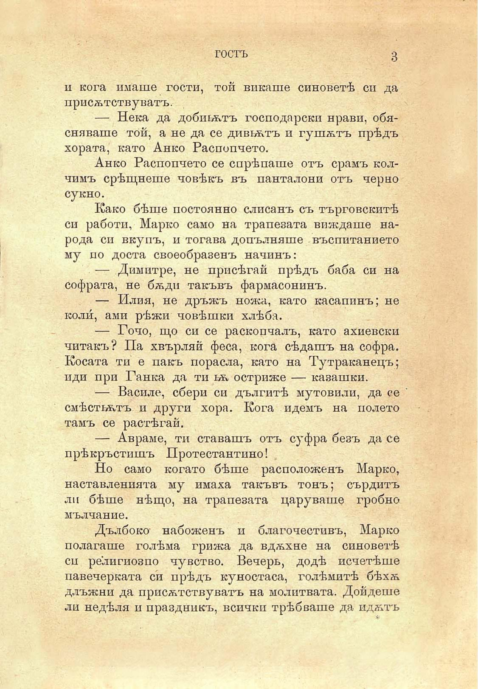

гостъ

и кога имаше гости, той викаше синоветѣ си да присѫствуватъ.

— Нека да добивътъ господарски нрави, обясняваше той, а не да се дивгѫтъ и гушѫтъ прѣдъ хората, като Анко Распопчето.

Анко Распопчето се спрѣ наше отъ срамъ колчимъ срѣщнеше човѣкъ въ панталони отъ черно сукно.

Како бѣше постоянно слисанъ съ търговскитѣ си работи, Марко само на трапезата виждаше народа си вкупъ, и тогава допълняше въспитанието му по доста своеобразенъ начинъ:

— Димитре, не присѣгай прѣдъ баба си на софрата, не бѫди такъвъ фармасонинъ.

— Илия, не дръжъ ножа, като касапинъ; не коли́, ами рѣжи човѣшки хлѣба.

— Гочо, що си се раскопчалъ, като ахиевски читакъ? Па хвърляй феса, кога сѣдашъ на софра. Косата ти е пакъ порасла, като на Тутраканецъ; иди при Ганка да ти ьъ остриже — казашки.

— Василе, сбери си дългитѣ мутовили, да се смѣстьътъ и други хора. Кога идемъ на полето тамъ се растѣгай.

— Авраме, ти ставашъ отъ суфра безъ да се прѣкръстишъ Протестантино!

Но само когато бѣше расположенъ Марко, наставленията му имаха такъвъ тонъ; сърдитъ ли бѣше нѣщо, на трапезата царуваше гробно мълчание.

Дълбоко набоженъ и благочестивъ, Марко полагаше голѣма грижа да вдѫхне на синоветѣ си религиозно чувство. Вечерь, додѣ исчетѣше павечерката си прѣдъ куностаса, голѣмитѣ бѣхѫ длъжни да присѫствуватъ на молитвата. Дойдеше ли недѣля и праздникъ, всички трѣбваше да идѫтъ

