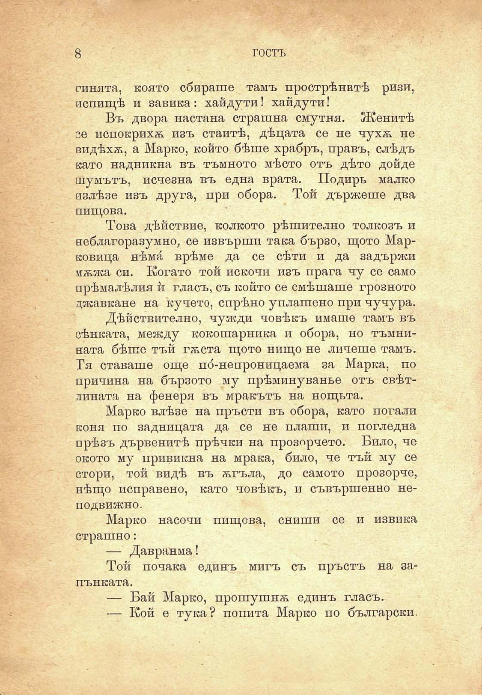

8

гостъ

синята, която сбираше тамъ прострѣнитѣ ризи, испищѣ и завика : хайдути! хайдути!

Въ двора настана страшна смутня. Женитѣ се испокрихѫ изъ стаитѣ, дѣцата се не чухѫ не видѣхѫ, а Марко, който бѣше храбръ, правъ, слѣдъ като надникна въ тъмното мѣсто отъ дѣто дойде шумътъ, исчезна въ една врата. Подиръ малко излѣзе изъ друга, при обора. Той държеше два пищова.

Това дѣйствие, колкото рѣшително толкозъ и неблагоразумно, се извърши така бързо, щото Марковица нѣма врѣме да се сѣти и да задържи мѫжа си. Когато той искочп изъ прага чу се само прѣмалѣлия и́ гласъ, съ който се смѣшаше грозното джавкане на кучето, спрѣно уплашено при чучура.

Дѣйствително, чужди човѣкъ имаше тамъ въ сѣнката, между кокошарника и обора, но тъмнината бѣше тъй гѫста щото нищо не личеше тамъ. Гя ставаше още по́-непроницаема за Марка, по причина на бързото му прѣминуванъе отъ свѣтлината на фенеря въ мракътъ на нощьта.

Марко влѣзе на пръсти въ обора, като погали коня по задницата да се не плаши, и погледна прѣзъ дървенитѣ прѣчки на прозорчето. Било, че окото му привикна на мрака, било, че тъй му се стори, той видѣ въ ѫгъла, до самото прозорче, нѣщо исправено, като човѣкъ, и съвършенно неподвижно.

Марко насочи пищова, сниши се и извика страшно:

— Давранма!

Той почака единъ мигъ съ пръстъ на запънката.

— Бай Марко, прошушнѫ единъ гласъ.

— Кой е тука? попита Марко по български.

