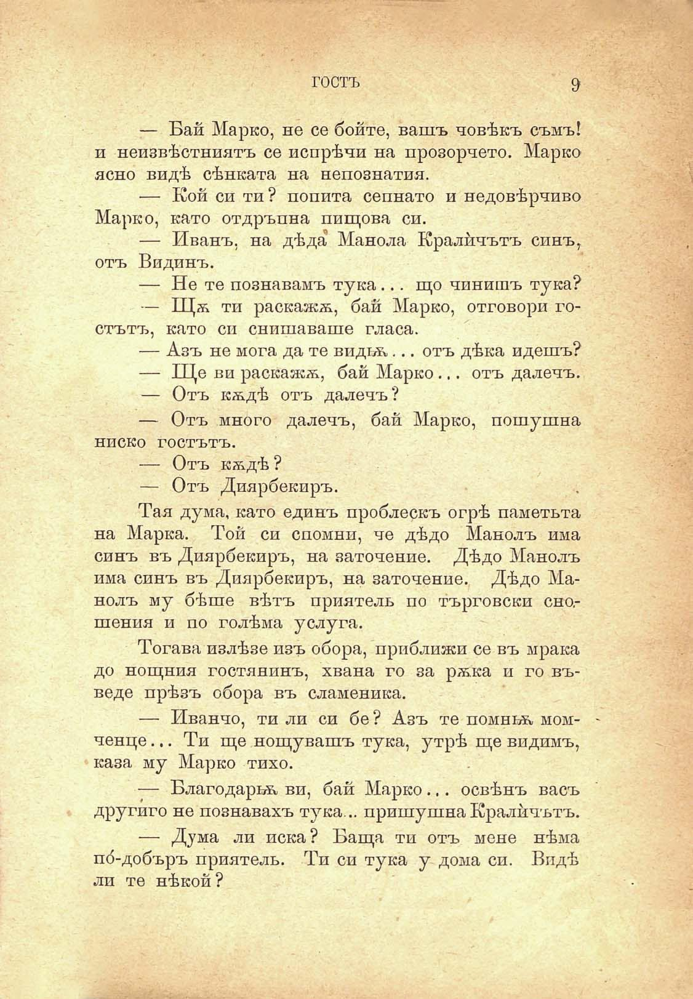

гостъ

9

■V

— Бай Марко, не се бойте, вашъ човѣкъ съмъ! и неизвѣстниятъ се попрѣчи на прозорчето. Марко ясно видѣ сѣнката на непознатия.

— Кой си ти ? попита сепнато и недовѣрчиво Марко, като отдръпна пищова си.

— Иванъ, на дѣда Манола Кралйчътъ синъ, отъ Видинъ.

— Не те познавамъ тука... що чинишъ тука?

— Щѫ ти раскажѫ, бай Марко, отговори гостътъ, като си снишаваше гласа.

— Азъ не мога да те видтѫ,... отъ дѣка идешъ?

— Ще ви раскажѫ, бай Марко... отъ далечъ.

— Отъ кѫдѣ отъ далечъ?

— Отъ много далечъ, бай Марко, пошушна ниско гостътъ.

— Отъ кѫдѣ?

— Отъ Диарбекиръ.

Тая дума, като единъ проблескъ огрѣ паметьта на Марка. Той си спомни, че дѣдо Манолъ има синъ въ Диярбекиръ, на заточение. Дѣдо Манолъ има синъ въ Диярбекиръ, на заточение. Дѣдо Манолъ му бѣше вѣтъ приятель по търговски сношения и по голѣма услуга.

Тогава излѣзе изъ обора, приближи се въ мрака до нощния гостянинъ, хвана го за рѫка и го въведе прѣзъ обора въ сламеника.

— Иванчо, ти ли си бе ? Азъ те помньк мом- ченце... Ти ще нощувашъ тука, утрѣ ще видимъ, каза му Марко тихо.

— Благодарна ви, бай Марко... освѣнъ васъ другиго не познавахъ тука... пришушнаКралйчътъ.

— Дума ли иска? Баща ти отъ мене нѣма по́-добъръ приятель. Ти си тука у дома си. Видѣ ли те нѣкой ?

я

