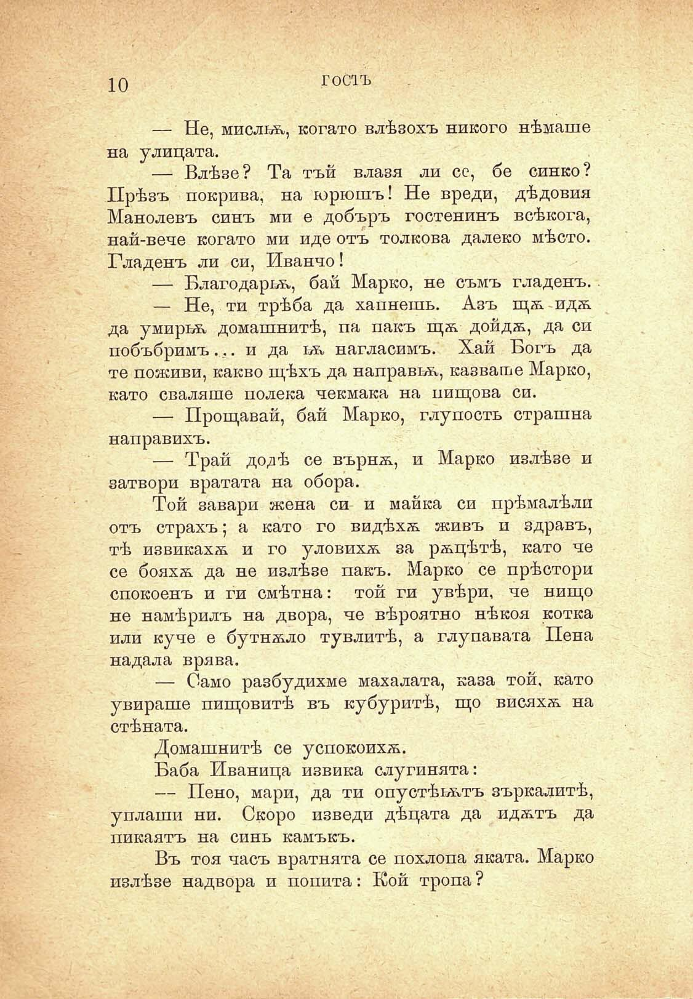

ГОСГ1Ъ

10

на

— Не, мисльѫ, когато влѣзохъ никого нѣмаше улицата.

— Влѣзе? Та тъй влазя ли се, бе синко?

-

!• .

сг

Й.:

Прѣзъ покрива, на юрюшъ! Не вреди, дѣдовия Маноловъ синъ ми е добъръ гостенинъ всѣкога, най-вече когато ми иде отъ толкова далеко мѣсто. Гладенъ ли си, Иванчо!

— Благодарна, бай Марко, не съмъ гладенъ.

— Не, ти трѣба да хапнешь. Азъ щѫ идѫ да умирьѫ, домашнитѣ, па пакъ щѫ дойдѫ, да си побъбримъ... и да ьѫ нагласимъ. Хай Богъ да те поживи, какво щѣхъ да направьщ казвате Марко, като сваляше полека чекмака на пищова си.

— Прощавай, бай Марко, глупость страшна направихъ.

— Трай додѣ се върнѫ, и Марко излѣзе и затвори вратата на обора.

Той завари жена си и майка си прѣмалѣли отъ страхъ; а като го видѣхѫ живъ и здравъ, тѣ извикахѫ и го уловихѫ за рѫцѣтѣ, като че се бояхѫ да не излѣзе пакъ. Марко се прѣстори спокоенъ и ги смѣтна: той ги увѣри, че нищо не намѣрилъ на двора, че вѣроятно нѣкоя котка или куче е бутнѫло тувлитѣ, а глупавата Лена падала врява.

— Само разбудихме махалата, каза той, като увираше пищовитѣ въ кубуритѣ, що висяхѫ на стѣната.

Домашнитѣ се успокоихѫ.

Баба Иваница извика слугинята:

— Пейо, мари, да ти опустѣьѫтъ зъркалитѣ, уплаши ни. Скоро изведи дѣцата да идѫтъ да пикаятъ на синь камъкъ.

Въ тоя часъ вратнята се похлопа яката. Марко излѣзе надвора и попита: Кой тропа ?

