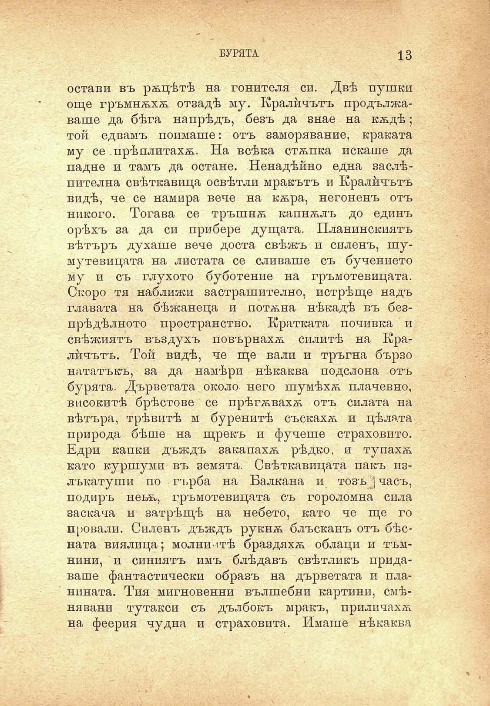

БУРЯТА

13

остави въ рѫцѣтѣ на гонителя си. Двѣ пушки още гръмнѫхѫ отзадѣ му. Кралйчътъ продължаваше да бѣга напрѣдъ, безъ да знае на кѫдѣ; той едвамъ поимаше: отъ заморявание, краката му се .прѣплитахѫ. На всѣка стѫпка искаше да падне и тамъ да остане. Ненадѣйно една заслѣпителна свѣткавица освѣтли мракътъ и Кралйчътъ видѣ, че се намира вече на кѫра, негоненъ отъ никого. Тогава се тръшнѫ капнѫлъ до единъ орѣхъ за да си прибере дущата. Планинскиятъ вѣтъръ духаше вече доста свѣжъ и силенъ, шумутевицата на листата се сливаше съ бучението му и съ глухото буботение на гръмотевицата. Скоро тя наближи застрашително, истрѣще надъ главата на бѣжанеца и потѫна нѣкадѣ въ безпрѣдѣлното пространство. Кратката почивка и свѣжиятъ въздухъ повърнахѫ силитѣ на Кралйчътъ. Той видѣ, че ще вали и тръгна бързо нататъкъ, за да намѣри нѣкаква подслона отъ бурята. Дърветата около него шумѣхѫ плачевно, високитѣ брѣстове се прѣгѫвахѫ отъ силата на вѣтъра, трѣвитѣ м буренитѣ съскаххѫ и цѣлата природа бѣше на щрекъ и фучеше страховито. Едри капки дъждъ закапахѫ рѣдко, и тупахѫ като куршуми въ земята. Свѣткавицата пакъ излъкатуши по гърба на Балкана и тозъ | часъ, подиръ неьщ гръмотевицата съ гороломна сила заскача м затрѣщѣ на небето, като че ще го провали. Силенъ дъждъ рукнѫ блъсканъ отъ бѣсната виялица; молниитѣ браздяхѫ облаци и тъмнини, и синиятъ имъ блѣдавъ свѣтликъ придаваше фантастически образъ на дърветата и планината. Тия мигновений вълшебни картини, смѣнявани тутакси съ дълбокъ мракъ, прилпчахѫ на феерия чудна и страховита. Имаше нѣкаква

