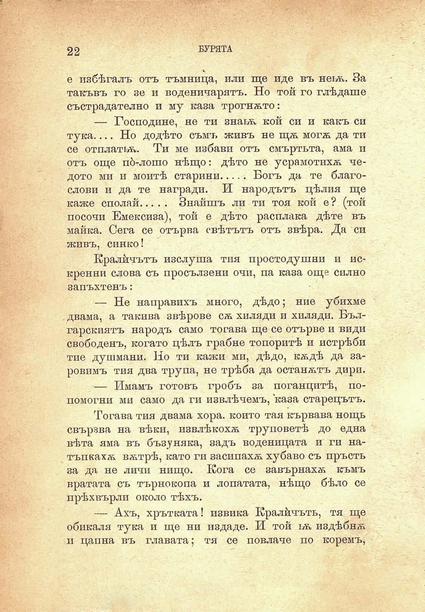

22

БУРЯТА

е избѣгалъ отъ тъмница, или ще иде въ нетѫ. За такъвъ го зе и воденичарятъ. Но той го глѣдаше състрадателно и му каза трогнѫто:

— Господине, не ти знагѫ кой си и какъ си тука.... Но додѣто съмъ живъ не щѫ могѫ да ти се отплаттѫ. Ти ме избави отъ смъртьта, ама и отъ още пд-лошо нѣщо: дѣто не усрамотихѫ чедото ми и моитѣ старини.....Богъ да те благослови и да те награди. И народътъ цѣлия ще каже сполай................. Знайшъ ли ти тоя кой е? (той посочи Емексиза), той е дѣто расплака дѣте въ майка. Сега се отърва свѣтътъ отъ звѣра. Да си живъ, синко!

Кралйчътъ изслуша тия простодушни и искренни слова съ просълзени очи, па каза още силно запъхтенъ:

— Не направихъ много, дѣдо; ние убихме двама, а такива звѣрове сѫ хиляди и хиляди. Българскиятъ народъ само тогава ще се отърве и види свободенъ, когато цѣлъ грабне топоритѣ и истрѣби тие душмани. Но ти кажи ми, дѣдо, кѫдѣ да заровимъ тия два трупа, не трѣба да останѫтъ дири.

— Имамъ готовъ гробъ за поганцитѣ, попомогни ми само да ги извлѣчемъ, каза старецътъ.

Тогава тия двама хора, който тая кървава нощь свързва на вѣки, извлѣкохѫ труповетѣ до една вѣта яма въ бъзуняка, задъ воденицата и ги натъпкахѫ вѫтрѣ, като ги засипахѫ хубаво съ пръсть за да не личи нищо. Кога се завърнахѫ къмъ вратата съ търнокопа и лопатата, нѣщо бѣло се прѣхвърли около тѣхъ.

— Ахъ, хрътката! извика Кралйчътъ, тя ще обикаля тука и ще ни издаде. И той ьѫ издѣбнѫ и цапна въ главата; тя се повлаче по коремъ,

