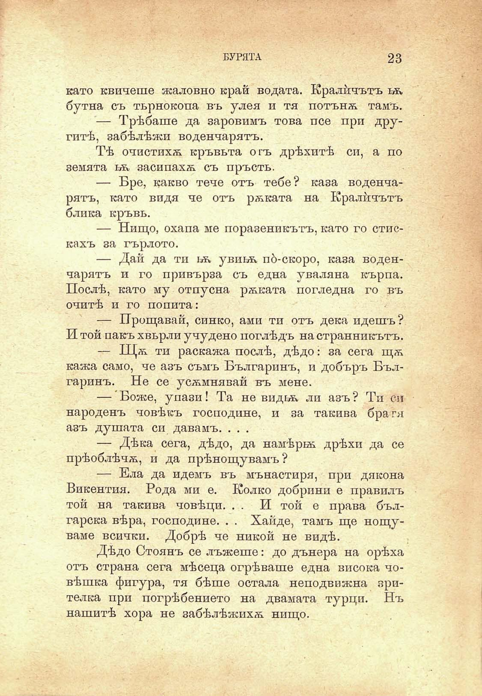

А- А- 'А/ . •Т7/',\ :-/^у\'-^^''-:'~^

БУРЯТА

23

като квичеше жаловно край водата. Кралйчътъ ьь. бутна съ търнокопа въ улея и тя потънѫ тамъ.

— Трѣбаше да заровимъ това псе при другитѣ, забѣлѣжи воденчарятъ.

Тѣ очистихѫ кръвьта огъ дрѣхитѣ си, а по земята ьк засипахѫ съ пръсть.

— Вре, какво тече отъ тебе? каза воденчарятъ, като видя че отъ рѫката на Кралйчътъ блика кръвь.

— Нищо, охапа ме поразеникътъ, като го стискахъ за гърлото.

— Дай да ти ьѫ увиьь, по́-скоро, каза воденчарятъ и го привърза съ една уваляна кърпа. Послѣ, като му отпусна рѫката погледна го въ очитѣ и го попита:

— Прощавай, синко, ами ти отъ дека идешъ ? И той пакъ хвърли учудено поглѣдъ на странникътъ.

— Щѫ ти раскажа послѣ, дѣдо: за сега щѫ кажа само, че азъ съмъ Българинъ, и добъръ Българинъ. Не се усѫмнявай въ мене.

— Боже, упази! Та не видьь, ли азъ ? Ти си народенъ човѣкъ господине, и за такива бра гя азъ душата си давамъ. . . .

— Дѣка сега, дѣдо, да намѣрьѫ дрѣхи да се прѣоблѣчѫ, и да прѣнощувамъ ?

— Ела да идемъ въ мънастиря, при дякона Викентия. Рода ми е. Колко добрини е правилъ той на такива човѣци. . . И той е права българска вѣра, господине. . . Хайде, тамъ ще нощуваме всички. Добрѣ че никой не видѣ.

Дѣдо Стоянъ се лъжеше: до дънера на орѣха отъ страна сега мѣсеца огрѣваше една висока човѣшка фигура, тя бѣше остала неподвижна зрителка при погрѣбението на двамата турци. Нъ нашитѣ хора не забѣлѣжихѫ нищо.

