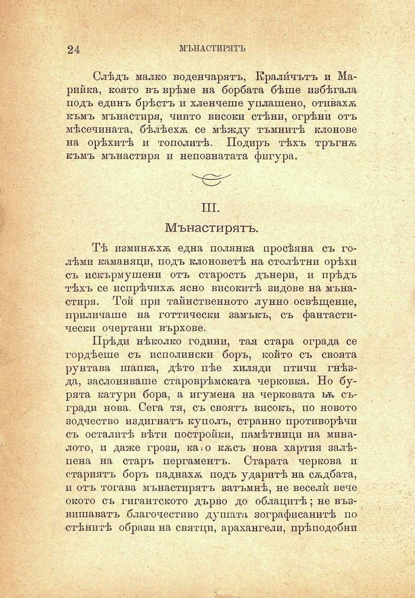



24	МЪНАСТИРЯТЪ

Слѣдъ малко воденчарятъ, Крали́чътъ и Марийка, която въ врѣме на борбата бѣше избѣгала подъ единъ брѣстъ и хленчеше уплашено, отивахѫ къмъ мънастиря, чиито високи стѣни, огрѣни отъ мѣсечината, бѣлѣехѫ се мѣжду тъмнитѣ клонове на орѣхитѣ и тополитѣ. Подиръ тѣхъ тръгнѫ къмъ мънастиря и непознатата фигура.

III.

Мънастирятъ.

ТѢ изминѫхѫ една полянка просѣяна съ голѣми каманяци, подъ клоноветѣ на столѣтни орѣхи съ искърмушени отъ старость дънери, и прѣдъ тѣхъ се испрѣчихѫ ясно високитѣ зидове на мънастиря. Той при тайнственното лунно освѣщение, приличаше на готтически замъкъ, съ фантастически очертани върхове.

Прѣди нѣколко години, тая стара ограда се гордѣеше съ исполински боръ, който съ своята рунтава шапка, дѣто пѣе хиляди птичи гнѣзда, заслоняваше староврѣмската черковка. Но бурята катури бора, а игумена на черковата ьѫ съгради нова. Сега тя, съ своятъ високъ, по новото зодчество издигнатъ куполъ, странно противорѣчи съ осталитѣ вѣти постройки, памѣтници на миналото, и даже грози, ка»о кѫсъ нова хартия залѣпена на старъ пергаментъ. Старата черкова и стариятъ боръ паднахѫ подъ ударитѣ на сѫдбата, и отъ тогава мънастирятъ затъмнѣ, не весели вече окото съ гигантското дърво до облацитѣ; не възвишаватъ благочестиво душата зографисанитѣ по стѣнитѣ образи на святци, арахангели, прѣподобни

