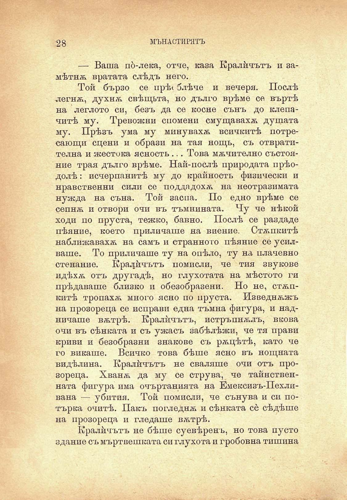

28

МЪНАСТИРЯТЪ

— Ваша по́-лека, отче, каза Кралйчътъ и замѣтнѫ вратата слѣдъ него.

Той бързо се ирѣ( блѣче и вечеря. Послѣ легнѫ, духнѫ свѣщьта, но дълго врѣме се въртѣ на леглото си, безъ да се косне сънъ до клепачитѣ му. Тревожни спомени смущавахѫ душата му. Прѣзъ ума му минувахѫ всичкитѣ потресающи сцени и образи на тая нощь, съ отвратителна и жестока ясность ... Това мѫчително състояние трая дълго врѣме. Най-послѣ природата прѣодолѣ: исчерпанитѣ му до крайность физически и нравствений сили се поддадохѫ на неотразимата нужда на съна. Той заспа. По едно врѣме се сепнѫ и отвори очи въ тъмнината. Чу че нѣкой ходи по пруста, тежко, бавно. Послѣ се раздаде пѣяние, което приличаше на виение. Стѫпкитѣ наближавахѫ на самъ и странното пѣяние се усилваше. То приличаше ту на опѣло, ту на плачевно стенание. Кралйчътъ помисли, че тия звукове идѣхѫ отъ другадѣ, но глухотата на мѣстото ги прѣдаваше близко и обезобразени. Но не, стѫпкитѣ тропахѫ много ясно по пруста. Изведнѫжъ на прозореца се неправи една тъмна фигура, и надничаше вѫтрѣ. Кралйчътъ, истръпнѫлъ, вкова очи въ сѣнката и съ ужасъ забѣлѣжи, че тя прави криви и безобразни знакове съ рѫцѣтѣ, като че го викаше. Всичко това бѣше ясно въ нощната ви дѣ лина. Кралйчътъ не сваляше очи отъ прозореца. Хванѫ да му се струва, че тайнственната фигура има очъртанията на Емексизъ-Пехливана — убития. Той помисли, че сънува и си потърка очитѣ. Пакъ погледнѫ и сѣнката се сѣдѣше на прозореца и гледаше вѫтрѣ.

Кралйчътъ не бѣше суевѣренъ, но това пусто здание съ мъртвешката си глухота и гробовна тишина

