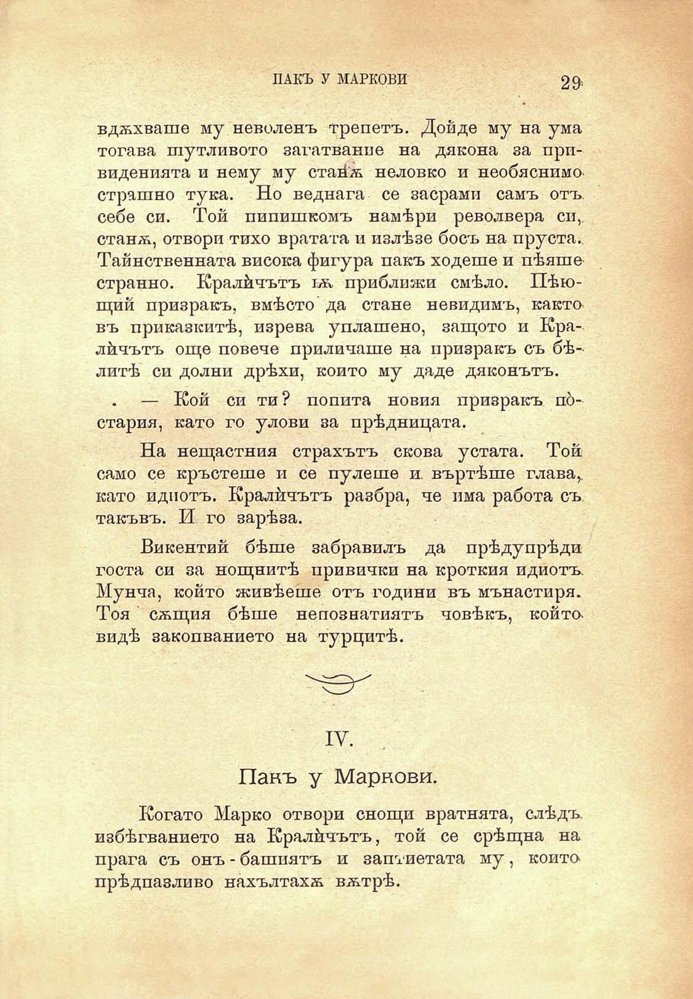

ПАКЪ У МАРКОВИ

29

вдѫхваше му неволенъ трепетъ. Дойде му на ума тогава шутливото загатвание на дякона за привиденията и нему му стаи́ѫ неловко и необяснимострашно тука. Но веднага се засрами самъ отъ себе си. Той пипишкомъ намѣри револвера си, станѫ, отвори тихо вратата и излѣзе босъ на пруста. Тайнственната висока фигура пакъ ходете и пѣяше странно. Кралйчътъ тѫ приближи смѣло. Пѣющий призракъ, вмѣсто да стане невидимъ, както въ приказкитѣ, изрева уплашено, защото и Кралйчътъ още повече приличаше на призракъ съ бѣлитѣ си долни дрѣхи, който му даде дяконътъ.

— Кой си ти? попита новия призракъ по́стария, като го улови за прѣдницата.

На нещастния страхътъ скова устата. Той само се кръстете и се пулете и. въртѣше глава,, като идиотъ. Кралйчътъ разбра, че има работа съ такъвъ. И го зарѣза.

Викентий бѣше забравилъ да прѣдупрѣди госта си за нощнитѣ привички на кроткия идиотъ. Мунча, който живѣеше отъ години въ мънастиря. Тоя сѫщия бѣше непознатиятъ човѣкъ, койтовидѣ закопванието на турцитѣ.

IV.

Пакъ у Маркови.

Когато Марко отвори снощи вратнята, слѣдъ избѣгванието на Кралйчътъ, той се срѣщна на прага съ онъ - башиятъ и заптиетата му, който прѣдпазливо нахълтахѫ вѫтрѣ.

