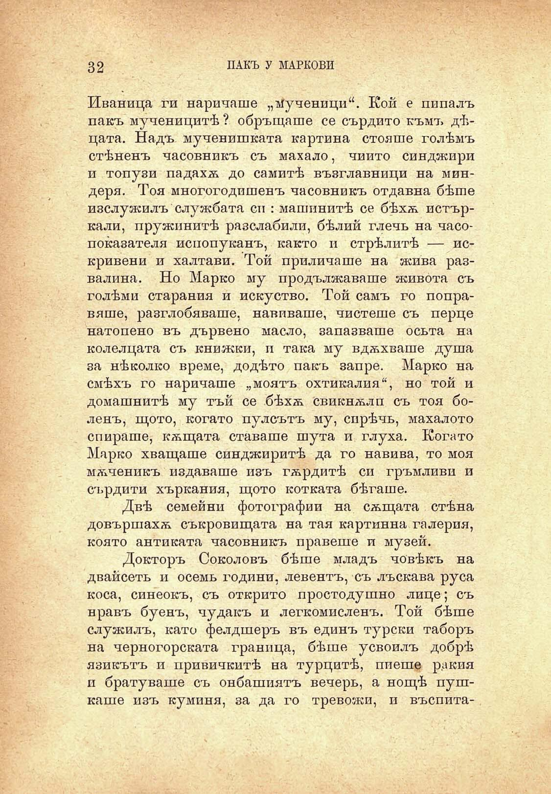

32	ПАКЪ У МАРКОВИ

Иваница ги наричаше „тученици“. Кой е пипалъ пакъ тученицитѣ ? обръщаше се сърдито къмъ дѣцата. Надъ мученишката картина стояше голѣмъ стѣненъ часовникъ съ махало, чийто синджири и топузи падахѫ до самитѣ възглавници на миндеря. Тоя многогодишенъ часовникъ отдавна бѣше изслужилъ службата си : машинитѣ се бѣхѫ потъркали, пружинитѣ разслаби ли, бѣлий глечь на часопоказателя непопуканъ, както и стрѣлитѣ — искривени и халтави. Той приличаше на жива развалина. Но Марко му продължаваше живота съ голѣми старания и искуство. Той самъ го поправяше, разглобяваше, навиваше, чистеше съ перце натопено въ дървено масло, запазваше осьта на колелцата съ книжки, и така му вдѫхваше душа за нѣколко време, додѣто пакъ запре. Марко на смѣхъ го наричаше „моятъ охтикалия“, но той и домашнитѣ му тъй се бѣхѫ Свикнѫлп съ тоя боленъ, щото, когато пулсътъ му, спрѣчь, махалото спираше, кѫщата ставаше шута и глуха. Когато Марко хващаше синджиритѣ да го навива, то моя мѫченикъ издаваше изъ гѫрдитѣ си гръмливи и сърдити хъркания, щото котката бѣгаше.

Двѣ семейни фотографии на сѫщата стѣна довършахѫ съкровищата на тая картинна галерия, която антиката часовникъ правете и музей.

Докторъ Соколовъ бѣше младъ човѣкъ на двайсеть и осемь години, левентъ, съ лъскава руса коса, синеокъ, съ открито простодушно лице; съ нравъ буенъ, чудакъ и легкомисленъ. Той бѣше служилъ, като фелдшеръ въ единъ турски таборъ на черногорската граница, бѣше усвоилъ добрѣ язикътъ и привичкитѣ на турцитѣ, пиепщ ракия и братуваше съ онбашиятъ вечерь, а нощѣ пушкаше изъ куминя, за да го тревожи, и въспита

