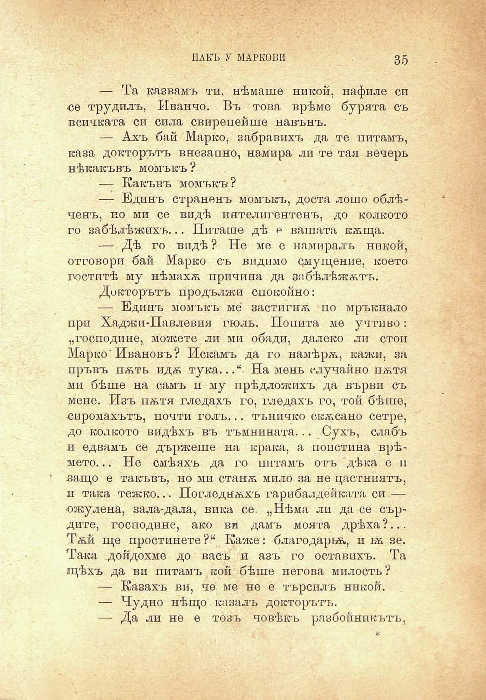

ПАКЪ У МАРКОВИ	35

— Та казвамъ ти, нѣмаше никой, нафиле си се трудилъ, Иванчо. Въ това врѣме бурята съ всичката си сила свирепейше навънъ.

— Ахъ бай Марко, забравихъ да те питамъ, каза докторътъ внезапно, намира ли те тая вечерь нѣкакъвъ момъкъ?

— Какъвъ момъкъ?

— Единъ страненъ момъкъ, доста лошо облѣченъ, но ми се видѣ интелигентенъ, до колкото го забѣлѣжихъ... Питаше дѣ о вашата кѫща.

— Дѣ го видѣ ? Не ме е намиралъ никой, отговори бай Марко съ видимо смущение, което гоститѣ му нѣмахѫ причина да забѣлѣжѫтъ.

Докторътъ продължи спокойно:

— Единъ момъкъ ме застигнѫ но мръкнало при Хаджи-Павлевия гюль. Попита ме учтиво: „господине, можете ли ми обади, далеко ли стои Марко’Ивановъ? Искамъ да го намѣрѫ, кажи, за пръвъ пѫть идѫ тука...“ На мень случайно пѫтя ми бѣше на самъ и му прѣдложихъ да върви съ мене. Изъ пѫтя гледахъ го, гледахъ го, той бѣше, сиромахътъ, почти голъ... тъничко скѫсано сетре, до колкото видѣхъ въ тъмнината... Сухъ, слабъ и едвамъ се държеше на крака, а попстина врѣмето... Не смѣяхъ да го питамъ отъ дѣка е п .защо е такъвъ, но ми станѫ мило за не цастниятъ, и така тежко... Погледнѫхъ гарибалдейката си — •ожулена, зала-дала, вика се. „Нѣма ли да се сърдите, господине, ако ви дамъ моята дрѣха ?... Тѫй ще простинете?“ Каже: благодарна, ижзе. Така дойдохме до васъ и азъ го оставихъ. Та щѣхъ да ви питамъ кой бѣше негова милость?

— Казахъ ви, че ме не е търсилъ никой.

— Чудно нѣщо казалъ докторътъ.

— Да ли не е тозъ човѣкъ разбойникътъ,

