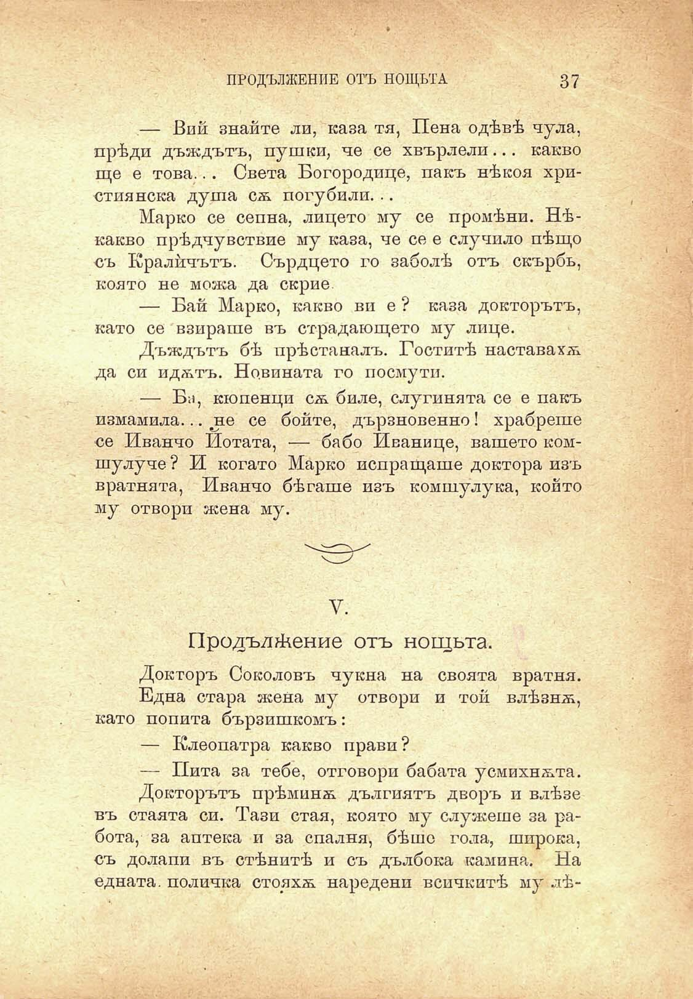

ПРОДЪЛЖЕНИЕ ОТЪ НОЩЬТА

37

— Вий знайте ли, каза тя, Цена одѣвѣ чула, прѣди дъждътъ, пушки, че се хвърлели... какво ще е това... Света Богородице, пакъ нѣкоя християнска душа сѫ погуби ли. ..

Марко се сепна, лицето му се промѣни. Нѣкакво прѣдчувствие му каза, че се е случило пѣщо съ Кралйчътъ. Сърдцето го заболѣ отъ скърбь, която не можа да скрие

— Бай Марко, какво ви е ? каза докторътъ, като се взираше въ страдающето му лице.

Дъждътъ бѣ прѣстаналъ. Гоститѣ наставахѫ да си идѫтъ. Новината го посмути.

— Би, кюпенци сѫ биле, слугинята се е пакъ измамила... .не се бойте, дързновенно! храбреше се Иванчо Нотата, — бабо Иванице, вашето комшулуче? И когато Марко испращаше доктора изъ вратнята, Иванчо бѣгаше изъ комшулука, който му отвори жена му.

V.

Продължение отъ нощьта.

Докторъ Соколовъ чукна на своята вратня.

Една стара жена му отвори и той влѣзнѫ, като попита бързишкомъ:

— Клеопатра какво прави?

— Пита за тебе, отговори бабата усмихнѫта.

Докторътъ прѣминѫ дългиятъ дворъ и влѣзе въ стаята си. Тази стая, която му служеше за работа, за аптека и за спалня, бѣше гола, широка, съ долапи въ стѣнитѣ и съ дълбока камина. На едната, поличка стояхѫ наредени всичкитѣ му лѣ

