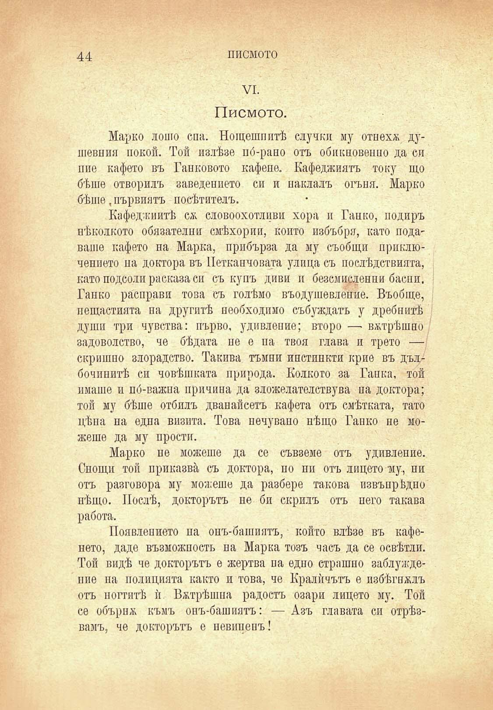

44

писмото

VI.

Писмото.

Марко лошо спа. Нотцешпитѣ случки му отнехж душевния покой. Той излѣзе пб-рано отъ обикновенпо да си пие кафето въ Танковото кафепе. Кафеджиятъ току що бѣше отворилъ заведението си и наклалъ огъня. Марко бѣше, първиятъ посѣтителъ.

Кафеджиитѣ сж словоохотливи хора и Гайко, подиръ нѣколкото обязателни смѣхории, който избъбря, като подаваше кафето на Марка, прибърза да му съобщи приключенпето на доктора въ Петканчовата улица съ послѣдствията, като подсоли расказа си съ купъ диви и безсмисленни басни. Гайко расправи това съ голѣмо въодушевление. Въобще, нещастията па другитѣ необходимо събуждатъ у дребнитѣ души три чувства: първо, удивление; второ — вѫтрѣшно задоволство, че бѣдата не е на твоя глава и трето — скришно злорадство. Такива тъмни инстинкти крие въ дълбочинитѣ си човѣшката природа. Колкото за Ганка, той имаше и по́-важна причина да зложелателствува па доктора; той му бѣше отбилъ дванайсеть кафета отъ смѣтката, тато цѣна на една визита. Това нечувано нѣщо Гайко не можеше да му прости.

Марко не можеше да се съвземе отъ удивление. Снощи той приказва съ доктора, но ни отъ лицето -му, ни отъ разговора му можеше да разбере такова извъпрЬдно нѣщо. Послѣ, докторътъ не би скрилъ отъ него такава работа.

Появлението на онъ-башиятъ, който влѣзе въ кафенето, даде възможность на Марка тозъ часъ да се освѣтли. Той видѣ че докторътъ е жертва на едно страшно заблуждепие па полицията както и това, че Кралйчътъ е избѣгналъ отъ ногтитѣ ѝ. Вѫтрѣшна радость озари лицето му. Той се обърна къмъ онъ-башиятъ: — Азъ главата си отрѣзвамъ, че докторътъ е невиненъ!

