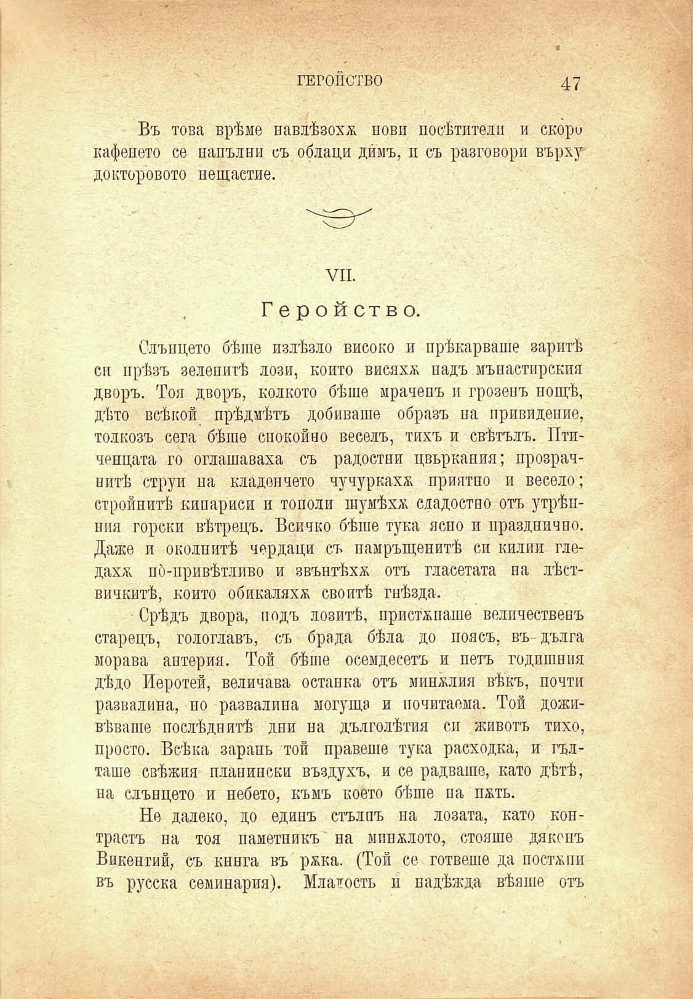

ГЕРОЙСТВО

47

Въ това врѣме навлѣзохѫ пови посѣгатели и скоро кафенето се напълни съ облаци димъ, и съ разговори върху' докторовото нещастие.

VII.

Геройство.

Слънцето бѣше излѣзло високо и прѣкарваше заритѣ си прѣзъ зеленитѣ лози, конто висяхж надъ мъпастирския дворъ. Тоя дворъ, колкото бѣше мраченъ и грозенъ пощѣ, дѣто всѣкой прѣдмѣтъ добиваше образъ на привидение, толкозъ сега бѣше спокойно веселъ, тихъ и свѣтълъ. Птиченцата го оглашаваха съ радостни цвъркания; прозрачнитѣ струи на кла дои чето чучуркаха приятно и весело; стройнитѣ кипариси и тополи шумѣха сладостно отъ утрѣпиия горски вѣтрецъ. Всичко бѣше тука ясно и празднично. Даже и околнитѣ чердаци съ намръщенитѣ си килии гледах& по́-привѣтлпво и звънтѣха отъ гласетата па лѣствичкитѣ, който обикаляха своитѣ гнѣзда.

Срѣдъ двора, подъ лозитѣ, пристѫпяше величественъ старецъ, гологлавъ, съ брада бѣла до поясъ, въ дълга морава антерия. Той бѣше осемдесеть и петъ годишния дѣдо Иеротей, величава останка отъ миналия вѣкъ, почти развалина, по развалина могуща и почитаема. Той доживѣваше послѣднитѣ дпи на дълголѣтия си животъ тихо, просто. Всѣка зарань той правете тука расходка, и гълташе свѣжия планински въздухъ, и се радваше, като дѣтѣ, на слънцето и небето, къмъ което бѣше на пжть.

Не далеко, до единъ стълпъ на лозата, като контрастъ на тоя паметникъ на миналото, стояше дяконъ Викентий, съ книга въ ржка. (Той се гответе да постѫпи въ русска семинария). Младость и падѣжда вѣяше отъ

