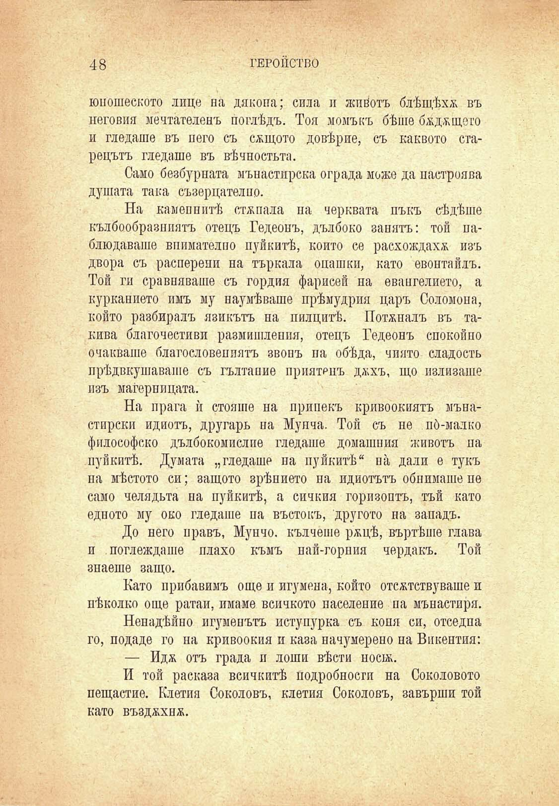

48	ГЕРОЙСТВО

юношеското лице на дякона; сила и жийотъ блѣщѣха въ неговия мечтателенъ поглѣдъ. Тоя момъкъ бѣше бжджщето и гледаше въ него съ сѫщото довѣрие, съ каквото старецътъ гледаше въ вѣчностьта.

Само безбурната мънастлрска ограда може да настройва душата така съзерцателно.

На каменнитѣ степала па черквата пъкъ сѣдѣше кълбообразниятъ отецъ Гедеонъ, дълбоко занятъ: той паблюдаваше внимателно пуйкитѣ, който се расхождахж изъ двора съ расперени на търкала опашки, като евонтайлъ. Той ги сравняваше съ гордия фарисей на евангелието, а курканието имъ му наумѣваше прѣмудрия царъ Соломона, който разбиралъ язикътъ на пилцитѣ. Потъналъ въ такива благочестиви размишления, отецъ Гедеонъ спокойно очакваше благословенията звонъ па обѣда, чиято сладость прѣдвкушаваше съ гьлтапие приятенъ джхъ, що излизаше изъ магерницата.

На прага ѝ стояше на припекъ кривоокиятъ мънастирски идиотъ, другарь на Мулча. Той съ не по́-малко философско дълбокомислпе гледаше домашния животъ на пуйкитѣ. Думата „гледаше на пуйкитѣ“ па дали е тукъ на мѣстото си; защото зрѣнието па идиотътъ обнимаше пе само челядьта на пуйкитѣ, а сичкия горизоптъ, тъй като едното му око гледаше па въстокъ, другото на западъ.

До него правъ, Мунчо. кълчеше ржцѣ, въртѣше глава и поглеждаше плахо къмъ пай-горния чердакъ. Той знаеше защо.

Като прибавимъ още и игумена, който отсѫствуваше и нѣколко още ратаи, имаме всичкото население па мънастиря.

Ненадѣйно игуменътъ иступурка съ коня си, отседпа го, подаде го па кривоокия и каза начумерено на Викентия:

— Идж отъ града и лоши вѣсти нос1Ж.

И той расказа всичкитѣ подробности на Соколовото нещастие. Клетия Соколовъ, клетия Соколовъ, завърши той като възджхнж.

