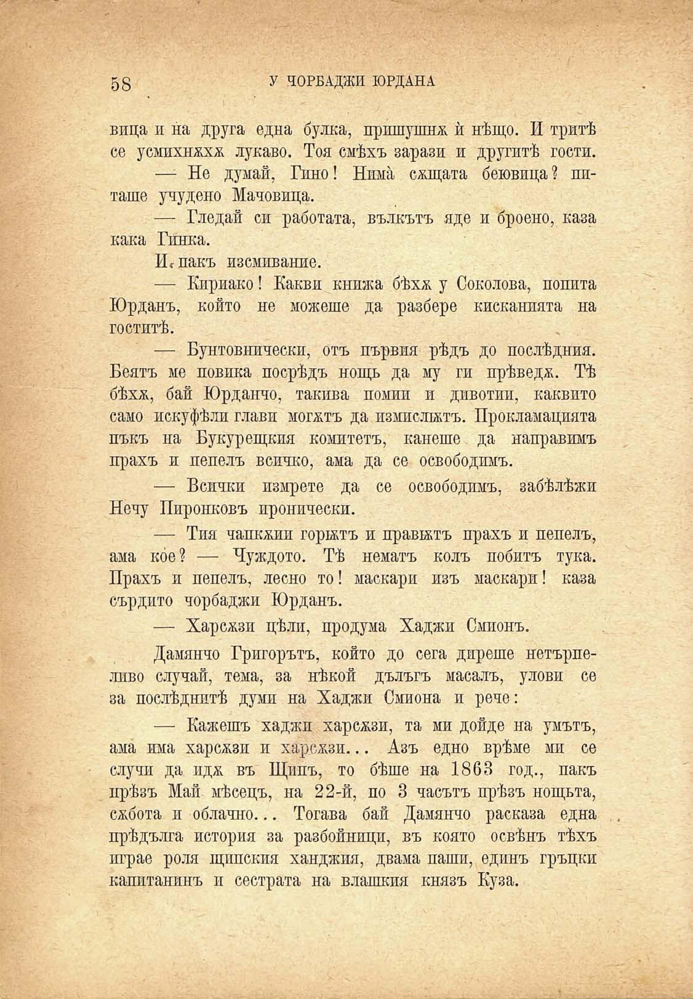

58	у ЧОРБАДЖИ ЮРДАНА

вица и на друга една булка, пришушнж ѝ нѣщо. И тритѣ се усмихнжхж лукаво. Тоя смѣхъ зарази и другитѣ гости.

—- Не думай, Гино! Нима сжщата беювица? питаше учудено Мачовица.

— Гледай си работата, вълкътъ яде и броено, каза кака Гинка.

ИсПакъ изсмивание.

— Кириако! Какви книжа бѣх& у Соколова, попита Юрданъ, който не можеше да разбере кисканията на гоститѣ.

— Бунтовнически, отъ първия рѣдъ до послѣдния. Беятъ ме повика посрѣдъ нощь да му ги прѣведа. Тѣ бѣхж, бай Юрданчо, такива помии и дивотии, каквито само искуфѣли глави могатъ да измислятъ. Прокламацията пъкъ на Букурещкия комитетъ, канете да направимъ прахъ и пепелъ всичко, ама да се освободимъ.

— Всички измрете да се освободимъ, забѣлѣжи Нечу Пиронковъ иронически.

— Тия чапкжии горятъ и правятъ прахъ и пепелъ, ама кое? — Чуждото. Тѣ нематъ колъ побитъ тука. Прахъ и пепелъ, лесно то! маскари изъ маскари! каза сърдито чорбаджи Юрданъ.

— Харсжзи цѣли, продума Хаджи Смпонъ.

Дамянчо Григорътъ, който до сега дирете нетърпеливо случай, тема, за нѣкой дълъгъ масалъ, улови се за послѣднитѣ думи на Хаджи Смиона и рече:

— Кажешъ хаджи харсжзи, та ми дойде на умътъ, ама има харс^зи и харс^зи... Азъ едно врѣме ми се случи да идж въ Щипъ, то бѣше на 1863 год., пакъ прѣзъ Май мѣсецъ, на 22-й, по 3 часътъ прѣзъ нощьта, сѫбота и облачно... Тогава бай Дамянчо расказа една прѣдълга история за разбойници, въ която освѣнъ тѣхъ играе роля щипения ханджия, двама паши, единъ гръцки капитанинъ и сестрата на влашкия князъ Куза.

