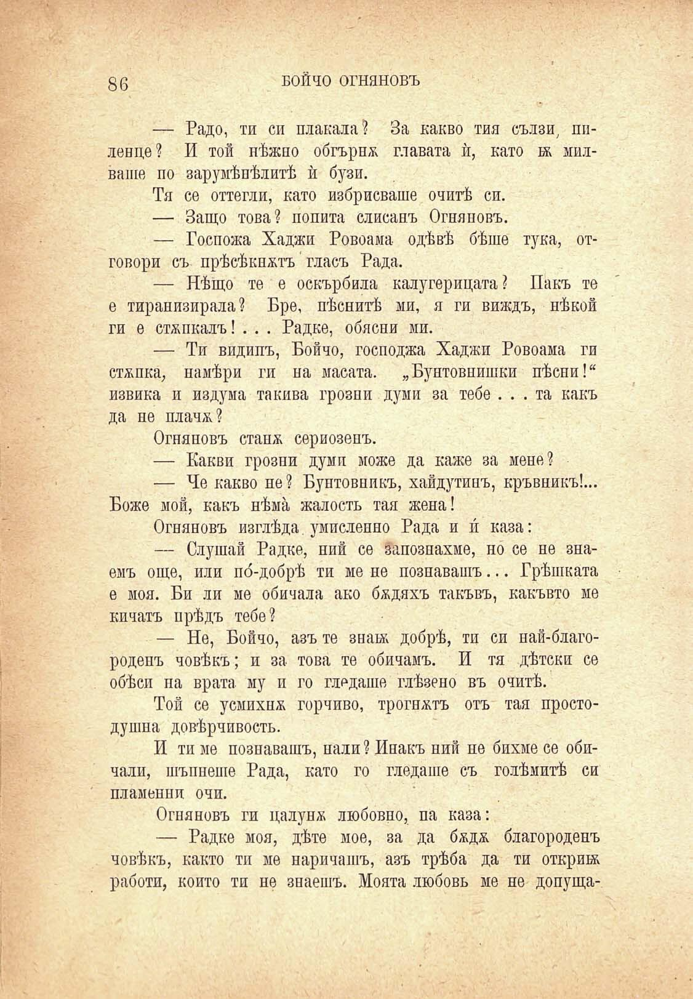

86

БОЙЧО ОГНЯНОВЪ

— Радо, ти си плакала? За какво тия сълзи, пиленце? И той пѣжпо обгърна главата ѝ, като въ милваше по зарумѣпѣлитѣ ѝ бузи.

Тя се оттегли, като избрисваше очитѣ си.

— Защо това? попита слисанъ Огняновъ.

— Госпожа Хаджи Ровоама одѣвѣ бѣше тука, отговори съ прѣсѣкнатъ'гласъ Рада.

— Нѣщо те е оскърбила калугерицата? Пакъ те е тиранизирала? Вре, пѣснитѣ ми, я ги виждъ, нѣкой ги е стѫпкалъ! . . . Радке, обясни ми.

— Ти видипъ, Бойчо, господжа Хаджи Ровоама ги стѫпка, намѣри ги на масата. „Бунтовнишки пѣсни!“ извика и издума такива грозни думи за тебе ... та какъ да не плачж?

Огняновъ стапя сериозенъ.

— Какви грозни думи може да каже за мене?

— Че какво не ? Бунтовникъ, хайдутинъ, кръвникъ!... Боже мой, какъ нѣма жалость тая жена!

Огняновъ изглѣда умисленно Рада и и́ каза:

— Слушай Радке, ний се запознахме, но се не знаемъ още, или по́-добрѣ ти ме не познавашъ... Грѣшката е моя. Би ли ме обичала ако бядяхъ такъвъ, какъвто ме кичатъ прѣдъ тебе?

— Не, Бойчо, азъ те знай; добрѣ, ти си най-благороденъ човѣкъ; и за това те обичамъ. И тя дѣтски се обѣси на врата му и го гледаше глѣзено въ очитѣ.

Той се усмихна горчиво, трогнятъ отъ тая простодушна довѣрчивость.

И ти ме познавашъ, пали ? Инакъ ний не бихме се обичали, шъпнеше Рада, като го гледаше съ голѣмитѣ си пламенни очи.

Огняновъ ги цалуня любовно, па каза:

— Радке моя, дѣте мое, за да бядя благороденъ човѣкъ, както ти ме наричашъ, азъ трѣба да ти откри® работи, който ти не знаешъ. Моята любовь ме не допуща-

