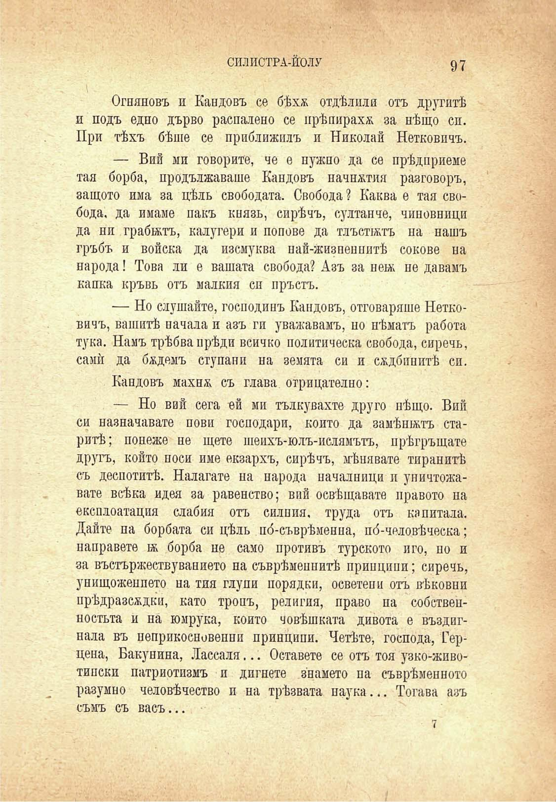

СИЛИСТРА-ЙОЛУ	97

Огняновъ и Кандовъ се бѣхѫ отдѣляли отъ другитѣ и подъ едно дърво распалено се прѣпираха за нѣщо сп. При тѣхъ бѣше се приближилъ и Николай Нетковичъ.

— Вий ми говорите, че е нужно да се прѣдприеме тая борба, продължаваше Кандовъ начнжтия разговоръ, защото има за цѣлъ свободата. Свобода? Каква е тая свобода. да имаме пакъ князъ, сирѣчъ, султанче, чиновници да ни грабилъ, калугери и попове да тлъстиятъ на нашъ гръбъ и войска да изсмуква най-жизненнитѣ сокове на народа! Това ли е вашата свобода? Азъ за неи; не давамъ капка кръвь отъ малкия сн пръстъ.

— Но слушайте, господинъ Кандовъ, отговаряше Нетковичъ, вашитѣ начала и азъ ги уважавамъ, но нѣматъ работа тука. Намъ трѣбва прѣди всичко политическа свобода, сиречъ, самѝ да бадемъ ступани на земята си и сѫдбинитѣ си.

Кандовъ махнж съ глава отрицателно:

— Но вий сега ей ми тълкувахте друго нѣщо. Вий си назначавате пови господари, който да замѣнилъ старитѣ; понеже не щете шеихъ-юлъ-ислямътъ, прѣгръщате другъ, който носи име екзархъ, сирѣчъ, мѣнявате тиранитѣ съ деспотитѣ. Налагате на народа началници и уничтожавате всѣка идея за равенство; вий освѣтявате правото на експлоатация слабия отъ силния, труда отъ капитала. Дайте па борбата си цѣлъ по́-съврѣменна, по́-человѣческа; направете бь борба не само противъ турското иго, но и за въстържествуванието на съврѣменнитѣ принципи; сиречъ, унищожението на тия глупи порядки, осветени отъ вѣковни прѣдразсадки, като тропъ, религия, право па собственостьта и на юмрука, който човѣшката дивота е въздигнала въ неприкосновения принципи. Четѣте, господа, Герцена, Бакунина, Лассаля... Оставете се отъ тоя узко-животипски патриотизмъ и дигнете знамето па съврѣменното разумно человѣчество и на трѣзвата наука... Тогава азъ

съмъ съ васъ...

