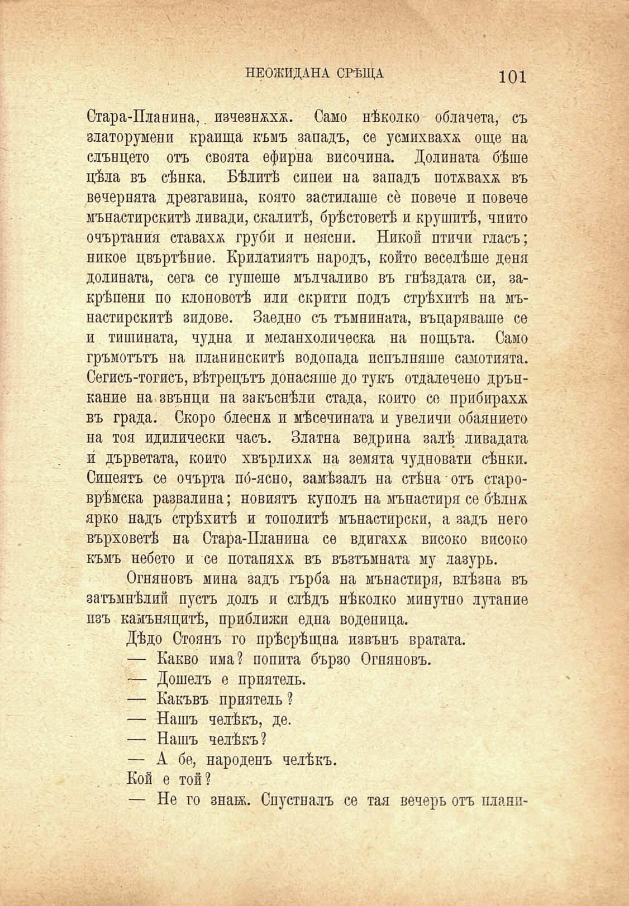

НЕОЯЖДАНА СРѢЩА	101

Стара-Планина,. изчезнжхж. Само нѣколко облачета, съ златорумени краища къмъ западъ, се усмихваха още на слънцето отъ своята ефирна височина. Долината бѣше цѣла въ сѣнка. Бѣлитѣ сипеи на западъ потжвахж въ вечернята дрезгавина, която застилаше се повече и повече мънастирскитѣ ливади, скалитѣ, брѣстоветѣ и крушитѣ, чийто очъртания ставаха груби и неясни. Никой птичи гласъ; никое цвъртѣние. Крилатиятъ народъ, който веселѣше деня долината, сега, се гушеше мълчаливо въ гнѣздата си, закрѣпени по клоноветѣ или скрити подъ стрѣхитѣ на мънастирскитѣ зидове. Заедно съ тъмнината, въцаряваше се и тишината, чудна и меланхолическа на нощьта. Само гръмотътъ на планинскитѣ водопада попълняше самотната. Сегисъ-тогисъ, вѣтрецътъ донасяше до тукъ отдалечено дрънкание на звънци па закъснѣли стада, който со прибираха въ града. Скоро блеснж и мѣсечината и увеличи обаянието на тоя идилически часъ. Златна ведрина залѣ ливадата и́ дърветата, който хвърлихѫ на земята чудновати сѣнки. Сипеятъ се очърта по́-ясно, замѣзалъ на стѣна отъ староврѣмска развалина; новиятъ куполъ на мънастиря се бѣлнж ярко надъ стрѣхитѣ и тополитѣ мънастирски, а задъ него върховетѣ на Стара-Планина се вдигаха високо високо къмъ небето и се потапяха въ възтъмната му лазуръ.

Огняновъ мина задъ гърба на мънастиря, влѣзна въ затъмнѣлий пустъ долъ и слѣдъ нѣколко минутно лутапие изъ камънацитѣ, приближи една воденица.

Дѣдо Стоянъ го прѣсрѣщна извънъ вратата.

— Какво има? попита бързо Огняновъ.

— Дошелъ е приятель.

— Какъвъ приятель ?

— Нашъ челѣкъ, де. — Нашъ челѣкъ? — А бе, народенъ челѣкъ. Кой е той?

— Не го знаж. Спустпалъ се тая вечерь отъ плани-

