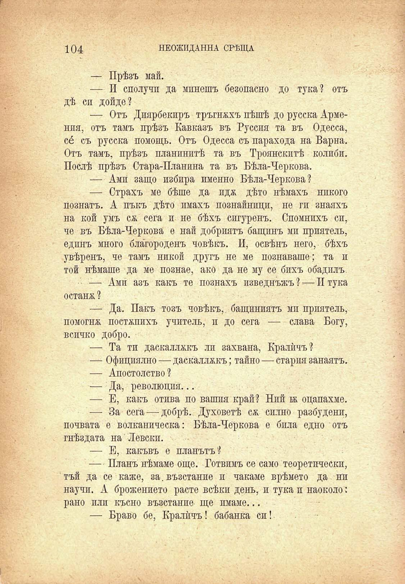

104

НЕОЖИДАННА СРѢЩА

— Прѣзъ май.

— И сполучи да минешъ безопасно до тука? отъ дѣ си дойде?

— Отъ Диярбекиръ тръгнахъ пѣшѣ до русска Армения, отъ тамъ прѣзъ Кавказъ въ Русспя та въ Одесса, се съ русска помощь. Отъ Одесса съ парахода на Варна. Отъ тамъ, прѣзъ планинитѣ та въ Троянскитѣ колиби. Послѣ прѣзъ Стара-Планина та въ Бѣла-Черкова.

— Ами защо избира именно Бѣла-Черкова?

— Страхъ ме бѣше да идж дѣто нѣмахъ никого познатъ. А пъкъ дѣто имахъ познайници, не ги знаяхъ на кой умъ сж сега и не бѣхъ сигуренъ. Спомнихъ сп, че въ Бѣла-Черкова е най добриятъ бащинъ ми приятель, единъ много благороденъ човѣкъ. И, освѣнъ него, бѣхъ увѣренъ, че тамъ никой другъ не ме познаваше; та и той нѣмаше да ме познае, ако да не му се бихъ обадилъ.

— Ами азъ какъ те познахъ изведнъжъ? — И тука остана ?

— Да. Пакъ тозъ човѣкъ, бащиниятъ ми приятель, помогна постѫпихъ учитель, и до сега — слава Богу, всичко добро.

— Та ти даскаллхкъ ли захвана, Кралѝчъ?

— Официално — даскаллжкъ; тайно — стария занаятъ.

— Апостолство?

— Да, революция...

— Е, какъ отива по вашия край? Ний бк оцапахме.

— За сега — добрѣ. Духоветѣ сж силно разбудени, почвата е волканическа: Бѣла-Черкова е била едно отъ гнѣздата на Левски.

— Е, какъвъ е планътъ?

— Планъ нѣмаме още. Готвимъ се само теоретически, тъй да се каже, за. възстание и чакаме врѣмето да ни научи. А брожението расте всѣки день, и тука и наоколо: рано или късно възстание ще имаме...

— Браво бе, Кралѝчъ! бабанка си!

