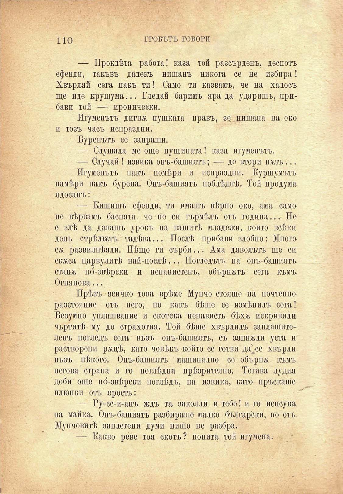

по

ГРОБЪТЪ ГОВОРИ

— Проклѣта работа! каза той разсърденъ, деспотъ ефенди, такъвъ далекъ нишанъ никога се не нзбпра! Хвърляй сега пакъ ти! Само ти казвамъ, че на халосъ ще иде крушума... Гледай баримъ яра да ударишъ, прибави той — иронически.

Игуменътъ дигпѫ пушката правъ, зе нишана па око и тозъ часъ испраздни.

Буренътъ се запраши.

— Слушала ме още пущината! каза игуменътъ.

— Случай ! извика ооъ-башиятъ; — де втори пжть...

Игуменътъ пакъ помѣри и испраздни. Куршумътъ намѣри пакъ бурена. Онъ-башиятъ поблѣднѣ. Той продума ядосанъ:

— Кишишъ ефенди, ти имашъ вѣрно око, ама само не вѣрвамъ баснята, че пе си гърмѣлъ отъ година... Не е злѣ да давашъ урокъ на вашитѣ младежи, който всѣки день стрѣлжтъ тадѣва... Послѣ прибави злобно: Много ся развилнѣяли. Нѣщо ги сърби... Ама дяволътъ ще си скжса царвулитѣ най-послѣ... Погледътъ па опъ-башпятъ стапя по́-звѣрски и ненавистенъ, обърнатъ сега къмъ Огнянова...

Прѣзъ всичко това врѣме Мунчо стояше па почтенно разстояние отъ него, но какъ бѣше се измѣнилъ сега! Безумно уплашвапие и скотска ненависть бѣхя искривили чьртитѣ му до страхотия. Той бѣше хвърлилъ заплашителенъ погледъ сега възъ онъ-башиятъ, съ зяпнжли уста и растворени ряцѣ, като човѣкъ който се готви даЧе хвърли възъ нѣкого. Онъ-башиять машинално се обърнѫ къмъ негова страна и го поглѣдна прѣзрително. Тогава лудия доби' още по́-звѣрски поглѣдъ, па извика, като пръскаше плюнки отъ ярость:

— Ру-сс-и-анъ ждъ та заколли и тебе! и го испсува на майка. Онъ-башиятъ разбираше малко български, по отъ Мунчовитѣ заплетени думи нищо не разбра.

— Какво реве тоя скотъ? попита той игумена.

