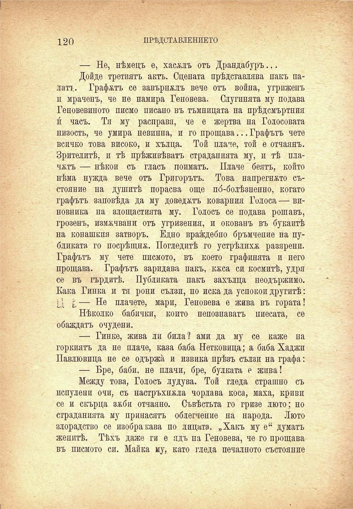

120	ПРѢДСТАВЛЕНИЕТО

— Не, нѣмецъ е, хасялъ отъ Драндабуръ...

Дойде третиятъ актъ. Сцената прѣдставлява пакъ палатт,. Графитъ се завърналъ вече отъ война, угриженъ и мраченъ, че не намира Геновева. Слугинята му подава Геновевиното писмо писано въ тъмницата на прѣдсмъртния и́ часъ. Тя му расправя, че е жертва на Голосовата низость, че умира невинна, и го прощава... Графътъ чете всичко това високо, и хълца. Той плаче, той е отчаянъ. Зрителитѣ, и тѣ прѣживѣватъ страданията му, и тѣ плач&тъ — нѣкои съ гласъ поиматъ. Плаче беятъ, който нѣма нужда вече отъ Григорътъ. Това напрегнато състояние па душитѣ порасва още по́-болѣзненно, когато графътъ заповѣда да му доводътъ коварния Голоса — виновника па злощастията му. Голосъ се подава рошавъ, грозенъ, измѫчвани отъ угризения, и окованъ въ букаитѣ на конашкия затворъ. Едно враждебно бръмчепие на публиката го посрѣщна. Погледитѣ го устрѣлихж разярени. Графътъ му чете писмото, въ което графинята и него прощава. Графътъ заридава пакъ, кжса си космитѣ, удря се въ гърдитѣ. Публиката пакъ захълца неодържимо. Кака Гинка и тя рони сълзи, по иска да успокои другитѣ: Ц — Не плачете, мари, Геновева е жива въ гората!

Нѣколко бабички, който непознаватъ пиесата, се обаждатъ очудени.

— Гинке, жива ли била? ами да му се каже на горкиятъ да не плаче, каза баба Нетковица; а баба Хаджи Павлювица не се одържа и извика прѣзъ сълзи на графа:

— Бре, баби, не плачи, бре, булката е жива!

Между това, Голосъ лудува. Той гледа страшно съ испулени очи, съ настръхвала чорлава коса, маха, криви се и скърца зжби отчаяно. Съвѣстьта го гризе люто; но страданията му принасятъ облегчение на народа. Люто злорадство се изобракава по лицата. „Хакъ му е“ думатъ женитѣ. Тѣхъ даже ги е ядъ па Геновева, че го прощава въ писмото си. Майка му, като гледа печалното състояние

