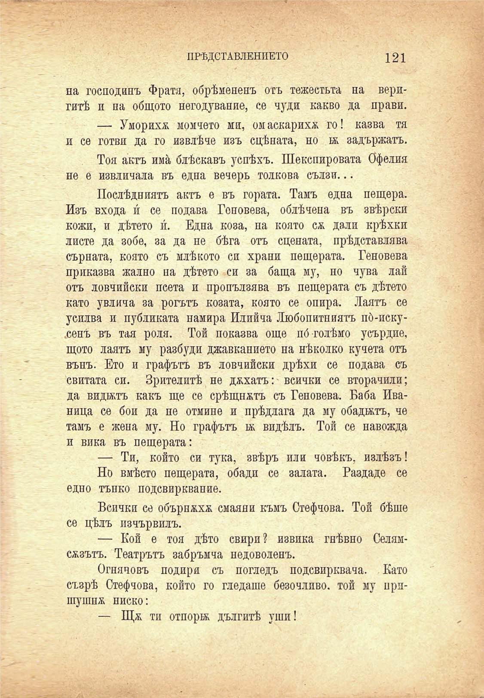

ПРѢДСТАВЛЕНИЕТО

121

на господинъ Фратя, обрѣмененъ отъ тежестьта на веригитѣ и на общото негодувание, се чуди какво да прави.

— Уморихѫ момчето ми, омаскарихѫ го! казва тя и се готви да го извлѣче изъ сцѣната, но въ задържатъ.

Тоя актъ има блѣскавъ успѣхъ. Шекспировата бфелия не е извличала въ една вечерь толкова сълзи...

Послѣдниятъ актъ е въ гората. Тамъ една пещера. Изъ входа и́ се подава Геновева, облѣчена въ звѣрски кожи, и дѣтето и́. Една коза, на която сѫ дали крѣхки листе да зобе, за да не бѣга отъ сцената, прѣдставлява сърната, която съ млѣкото си храни пещерата. Геновева приказва жално на дѣтето си за баща му, но чува лай отъ ловчийски псета и пропълзява въ пещерата съ дѣтето като увлича за рогътъ козата, която се опира. Лаятъ се усилва и публиката намира Илийча Любопитниятъ по́-иску.сенъ въ тая роля. Той показва още пб голѣмо усърдие, щото лаятъ му разбуди джавканието на нѣколко кучета отъ вънъ. Ето и графътъ въ ловчийски дрѣхи се подава съ свитата си. Зрителитѣ не духатъ: всички се вторачили; да видътъ какъ ще се срѣщнатъ съ Геновева. Баба Иваница се бои да не отмине и прѣдлага да му обадилъ, че тамъ е жена му. Но графътъ и. видѣлъ. Той се навожда и вика въ пещерата:

— Ти, който си тука, звѣръ или човѣкъ, излѣзъ!

Но вмѣсто пещерата, обади се залата. Раздаде се едно тънко подсвирквание.

Всички се обърнххж смаяни къмъ Стефчова. Той бѣше се цѣлъ изчървилъ.

— Кой е тоя дѣто свири? извика гнѣвно Селямсжзътъ. Театрътъ забръмча недоволенъ.

Огняновъ подири съ погледъ подсвирквана. Като съзрѣ Стефчова, който го гледаше безочливо, той му пришушнж ниско:

— ти отпора дългитѣ уши!

