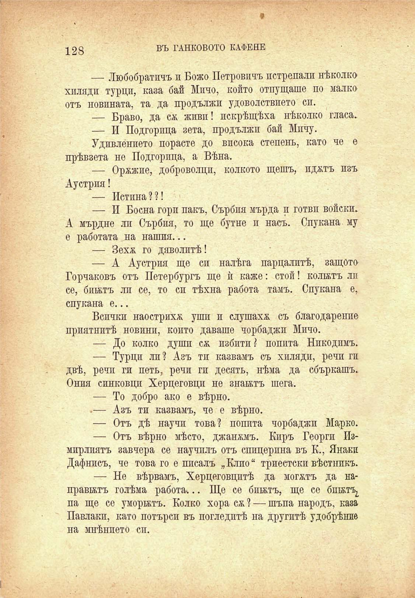

128

ВЪ ТАНКОВОТО КАФЕНЕ

— Любобратичъ и Божо Петровичъ потропали нѣколко хиляди турци, каза бай Мпчо, който отпущаше по малко отъ новината, та да продължи удоволствието сп.

— Браво, да см живп! пскрѣщѣха нѣколко гласа.

— И Подгорпца зета, продължи бай Мпчу.

Удивлението порасте до висока степень, като че е прѣвзета не Подгорпца, а Вѣна.

— Оржжие, доброволци, колкото щешъ, пджтъ изъ Аустрия!

— Истина??!

— И Босна гори пакъ, Сърбпя мърда и готви войски. А мърдне ли Сърбия, то ще бутне и насъ. Спукана му е работата на нашия...

— Зехж го дяволитѣ!

— А Аустрия ще си налѣга парцалитѣ, защото Горчаковъ отъ Петербургъ ще ѝ каже: стой! колитъ ли се, бинтъ ли се, то си тѣхна работа тамъ. Спукана е, спукана е...

Всички наострихѫ уши и слушаха съ благодарение приятнитѣ новини, който даваше чорбаджи Мичо.

— До колко души сѫ пзбити ? попита Нпкодимъ.

— Турци ли? Азъ ти казвамъ съ хиляди, речи ги двѣ, речи ги петь, речи ги десять, нѣма да сбъркашъ. Ония синковци Херцеговци не знантъ шега.

— То добро ако е вѣрно.

.— Азъ ти казвамъ, че е вѣрно.

— Отъ дѣ научи това? попита чорбаджи Марко.

— Отъ вѣрно мѣсто, джанжмъ. Киръ Георги Измирлиятъ завчера се научилъ отъ спицерпна въ К., Янаки Дафнисъ, че това го е писалъ „Клио“ Триестски вѣстникъ.

— Не вѣрвамъ, Херцеговцитѣ да могатъ да направитъ голѣма работа... Ще се бинтъ, ще се бпнтъ^ па ще се уморитъ. Колко хора сѫ ? — шъпа народъ, каза Павлаки, като потърси въ погледитѣ на другитѣ удобрѣние на мнѣнието сп.

