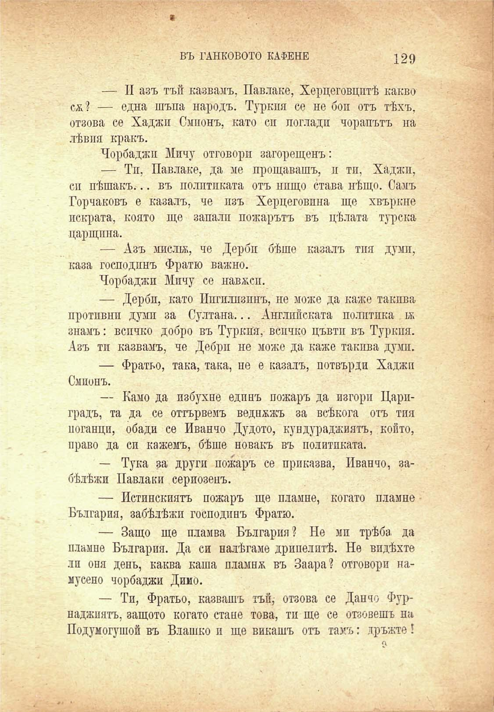

ВЪ ТАНКОВОТО КАФЕНЕ

129

— II азъ тъй казвамъ. Павлаке, Херцеговцитѣ какво саЛ — една шъпа народъ. Туркпя се не боп отъ тѣхъ, отзова се Хаджи Смионъ, като си поглади чорапътъ на лѣвия кракъ.

Чорбаджи Мичу отговори загорещенъ:

— Тп, Павлаке, да ме прощавашъ, и тп, Хаджи, сп пѣшакъ... въ политиката отъ нищо става нѣщо. Самъ Горчаковъ е казалъ, че изъ Херцеговина ще хвъркне искрата, която ще запали пожарътъ въ цѣлата турска царщина.

— Азъ мисли;, че Дерби бѣше казалъ тия думи, каза господинъ Фратю важно.

Чорбаджи Мичу се навеси.

— Дерби, като Ипгилизпнъ, не може да каже такива противни думи за Султана... Английската политика 1ж знамъ: всичко добро въ Туркпя, всичко цъвтп въ Туркпя. Азъ тп казвамъ, че Дебри не може да каже такива думи.

— Фратьо, така, така, не е казалъ, потвърди Хаджи Смионъ.

— Камо да избухне единъ пожаръ да изгори Цариградъ, та да се отгърнемъ веднажъ за всѣкога отъ тия поганци, обади се Иванчо Дудото, кундураджиятъ, който, право да си кажемъ, бѣше новакъ въ политиката.

— Тука за други пожаръ се приказва, Иванчо, забѣлѣжи Павлаки сериозенъ.

— Истинскиятъ пожаръ ще пламне, когато пламне България, забѣлѣжи господинъ Фратю.

— Защо ще пламва България? Не ми трѣба да пламне Българпя. Да си налѣгаме дрипелитѣ. Не видѣхте лп оня день, каква каша пламна въ Заара? отговори намусено чорбаджи Димо.

— Ти, Фратьо, казвашъ тъй, отзова се Данчо Фурнаджиятъ, защото когато стане това, ти ще се отзовешъ на Подумогушой въ Влашко и ще викашъ отъ тамъ: дръжте!

