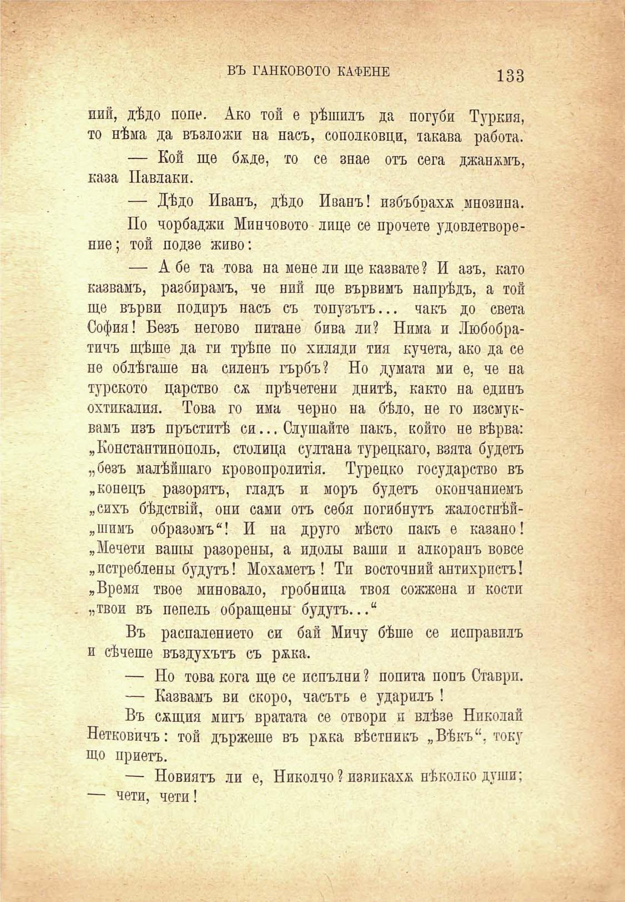

ВЪ ТАНКОВОТО КАФЕНЕ

133

иий, дѣдо поне. Ако той е рѣшилъ да погуби Туркия, то нѣма да възложи на насъ, сополковци, такава работа.

— Кой ще баде, то се знае отъ сега джапамъ, каза Павлаки.

— Дѣдо Иванъ, дѣдо Иванъ! избъбрахж мнозина.

По чорбаджи Минчовото лице се прочете удовлетворение; той подзе живо:

— А бе та това на мене ли ще казвате? И азъ, като казвамъ, разбирамъ, че ний ще вървимъ напрѣдъ, а той ще върви подиръ насъ съ топузътъ... чакъ до света София! Безъ негово питане бива ли? Нима и Любобратичъ щѣше да ги трѣпе по хиляди тия кучета, ако да се не облѣгаше на силенъ гърбъ? Но думата ми е, че на турското царство сѫ прѣчетени днитѣ, както на единъ охтикалия. Това го има черно на бѣло, не го изсмуквамъ изъ пръститѣ си... Слушайте пакъ, който не вѣрва: „Константинополь, столица султана турецкаго, взята будетъ „безъ малѣйшаго кровопролиття. Турецко государство въ „конецъ разорятъ, гладъ и моръ будетъ окоичаниемъ „сихъ бѣдствш, они сами отъ себя погибнутъ жалостнѣй„шимъ образомъ“! И на друго мѣсто пакъ е казино! „Мечети ваши разоренъ!, а идоли ваши и алкорапъ вовсе „истреблень! будутъ! Мохаметъ! Ти восточний антихристъ! „Время твое миновало, гробница твоя сожжена и кости „твои въ пепель обращенм будутъ...ц

Въ распалението си бай Мичу бѣше се исправилъ и сѣчеше въздухътъ съ рада.

— Но това кога ще се непълни ? попита попъ Ставри.

— Казвамъ ви скоро, часътъ е ударилъ !

Въ сжщия мигъ вратата се отвори и влѣзе Николай Нетковичъ: той държеше въ ржка вѣстникъ „Вѣкъ“, току що приетъ.

— Новиятъ ли е, Николчо? извикаха нѣколко души; — чети, чети!

