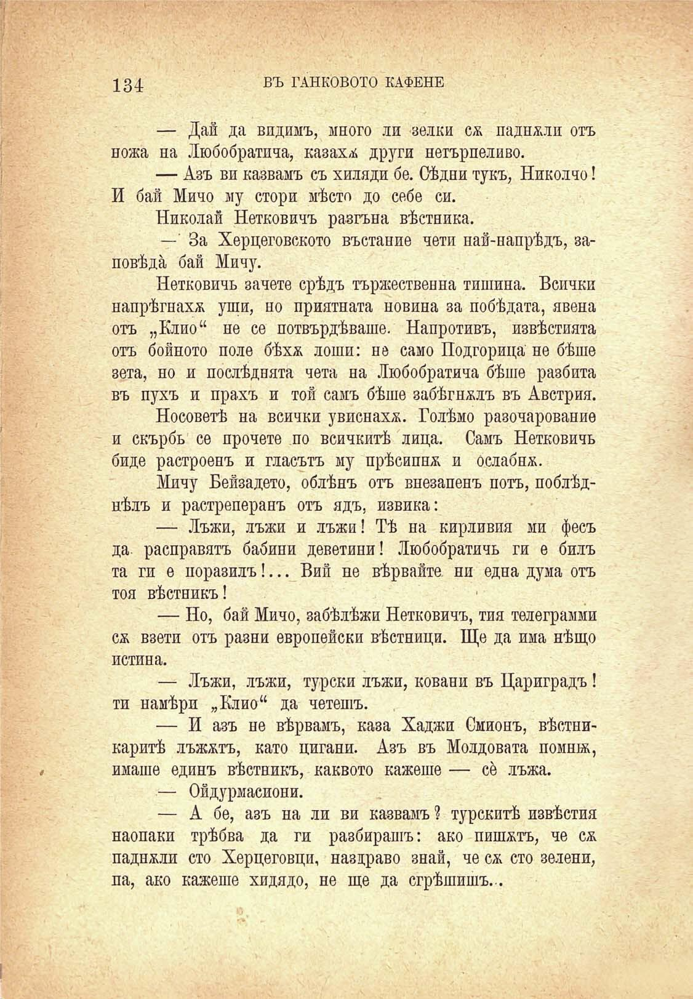

134	въ ТАНКОВОТО КАФЕНЕ

— Дай да видимъ, много ли зелки сѫ паднжлп отъ ножа на Любобратича, казаха други нетърпеливо.

— Азъ ви казвамъ съ хиляди бе. Сѣдни тукъ, Николчо! И бай Мичо му стори мѣсто до себе си.

Николай Нетковичъ разгъна вѣстника.

— За Херцеговското въстание чети най-напрѣдъ, заповѣда бай Мичу.

Нетковичъ зачете срѣдъ тържественна тишина. Всички напрѣгнахж уши, но приятната новина за побѣдата, явена отъ „Клио“ не се потвърдѣваше. Напротивъ, извѣстията отъ бойното поле бѣхѫ лоши: не само Подгорица не бѣше зета, но и послѣднята чета на Любобратича бѣше разбита въ пухъ и прахъ и той самъ бѣше забѣгналъ въ Австрия.

Носоветѣ на всички увиснаха. Голѣмо разочарование и скърбь се прочете по всичкитѣ лица. Самъ Нетковичъ биде растроенъ и гласътъ му прѣсипна и ослабнж.

Мичу Бейзадето, облѣнъ отъ внезапенъ поть, поблѣднѣлъ и растреперанъ отъ ядъ, извика:

— Лъжи, лъжи и лъжи! Тѣ на кирливия ми фесъ да. расправятъ бабини деветини! Любобратичъ ги е билъ та ги е поразилъ!... Вий не вѣрвайте, ни една дума отъ тоя вѣстникъ!

— Но, бай Мичо, забѣлѣжи Нетковичъ, тия телеграмми сж взети отъ разни европейски вѣстници. Ще да има нѣщо истина.

— Лъжи, лъжи, турски лъжи, ковани въ Цариградъ ! ти намѣри „Клио“ да четешъ.

— И азъ не вѣрвамъ, каза Хаджи Смионъ, вѣстникаритѣ лъжатъ, като цигани. Азъ въ Молдовата помнж, имаше единъ вѣстникъ, каквото кажеше — се лъжа.

— Ойдурмасиони.

— А бе, азъ на ли ви казвамъ ? турскитѣ извѣстия наопаки трѣбва да ги разбирашъ: ако пишатъ, че сж паднжли сто Херцеговци, наздраво знай, че сѫ сто зелени, па, ако кажеше хидядо, не ще да сгрѣшишъ...

