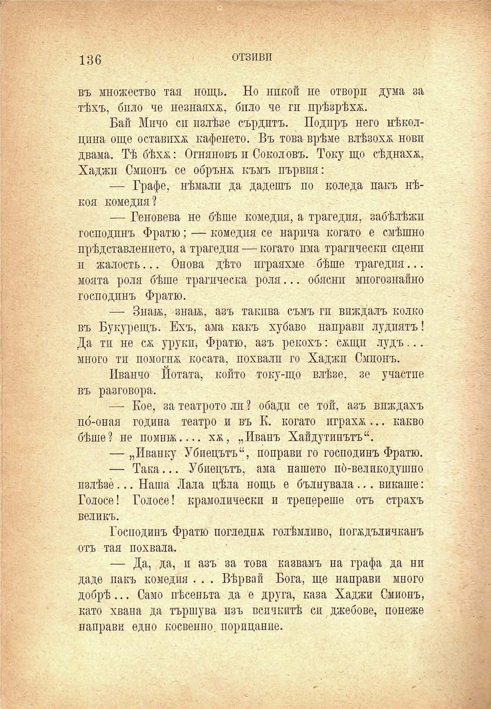

136

отзиви

въ множество тая нощь. Но никой не отвори дума за тѣхъ, било че незнаяхж, било че гп прѣзрѣха.

Бай Мичо си излѣзе сърдитъ. Подиръ него нѣкол-цина още оставихѫ кафенето. Въ това врѣме влѣзоха нови двама. Тѣ бѣхж: Огняновъ и Соколовъ. Току що сѣднаха, Хаджи Смпонъ се обръня къмъ първия:

— Графе, нѣмали да дадешъ по Коледа пакъ нѣ-коя комедия?

— Геновева не бѣше комедия, а трагедия, забѣлѣжи господинъ Фратю; — комедия се нарича когато е смѣшно прѣдставлението, а трагедия — когато има трагически сцени и жалость... Окова дѣто пграяхме бѣше трагедия... моята роля бѣше трагическа роля... обясни многознайко господинъ Фратю.

— Знай;, знакъ, азъ такива съмъ гп виждалъ колко въ Букурещъ. Ехъ, ама какъ хубаво направи лудиятъ! Да ти не см урукщ Фратю, азъ рекохъ: сади лудъ... много ти помогна косата, похвали го Хаджи Смпонъ.

Иванчо Нотата, който току-що влѣзе, зе участие въ разговора.

— Кое, за театрото ли ? обади се той, азъ виждахъ п(5-оная година театро и въ К. когато играха... какво бѣше? не помнж.... хж, „Иванъ Хайдутинътъ“.

— „Иванку Убиецътъ“, поправи го господинъ Фратю.

— Така... Убиецътъ, ама нашето по́-велико душно пзлѣзе... Наша Лала цѣла нощь е бълнувала ... викаше: Голосе! Колосе! крамолическп и треперете отъ страхъ великъ.

Господинъ Фратю погледна голѣмливо, погждъличканъ отъ тая похвала.

— Да, да, и азъ за това казвамъ на графа да ни даде пакъ комедия . . . Вѣрвай Бога, ще направи много добрѣ... Само пѣсеньта да е друга, каза Хаджи Смионъ, като хвана да тършува изъ всичкитѣ си джобове, понеже направи едно косвенпо. порицание.

