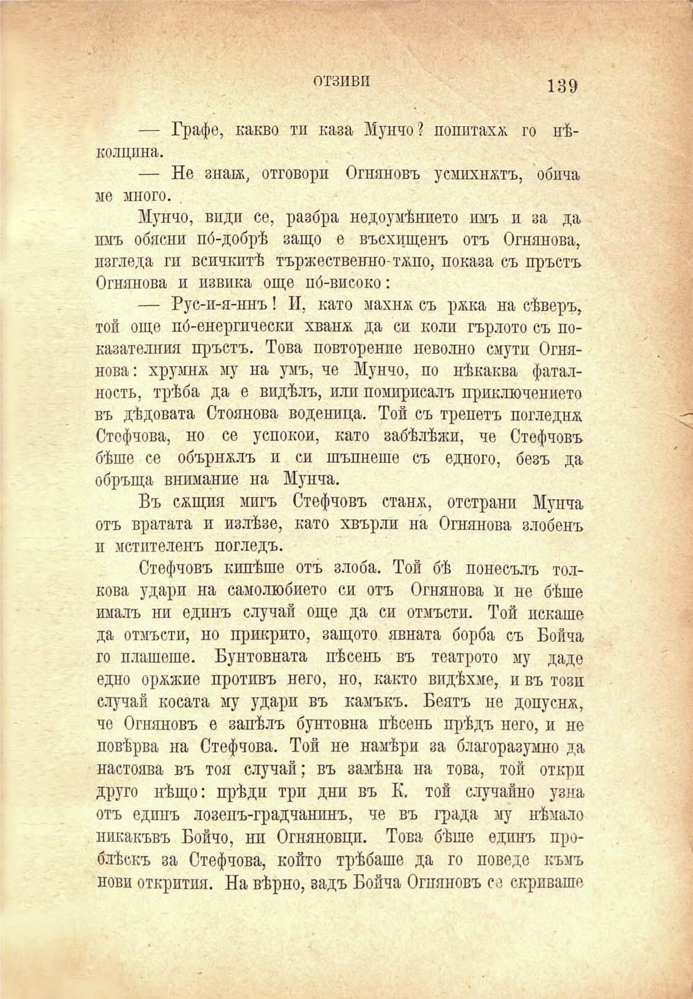

отзиви	139

— Графе, какво тп каза Мунчо? попитаха го нѣколцина.

— Не знай, отговори Огняновъ усмихнатъ, обича ме много.

Мунчо, види се, разбра недоумѣнието имъ и за да имъ обясни по́-добрѣ защо е въсхищенъ отъ Огнянова, изгледа ги всичкитѣ тържественно-тжпо, показа съ пръстъ Огнянова и извика още по́-високо:

— Рус-и-я-ннъ! И, като махнж съ ржка на сѣверъ, той още по́-енергически хванж да си коли гърлото съ показателния пръстъ. Това повторение неволно смути Огнянова: хрумнж му на умъ, че Мунчо, по нѣкаква фаталность, трѣба да е видѣлъ, или помирисалъ приключението въ дѣдовата Стоянова воденица. Той съ трепетъ погледна Стефчова, но се успокои, като забѣлѣжи, че Стефчовъ бѣше се обърналъ и си шъпнеше съ едното, безъ да обръща внимание на Мунча.

Въ сжщия мигъ Стефчовъ станх, отстрани Мунча отъ вратата и излѣзе, като хвърли на Огнянова злобенъ п метателенъ погледъ.

Стефчовъ кипѣше отъ злоба. Той бѣ понесълъ толкова удари на самолюбието си отъ Огнянова и не бѣше ималъ ни единъ случай още да си отмъсти. Той искаше да отмъсти, но прикрито, защото явната борба съ Бойча го плашеше. Бунтовната пѣсень въ театрото му даде едно оржжие противъ него, но, както видѣхме, и въ този случай косата му удари въ камъкъ. Беятъ не допусна, че Огняновъ е запѣлъ бунтовна пѣсень прѣдъ него, и не повѣрва на Стефчова. Той не намѣри за благоразумно да настоява въ тоя случай; въ замѣна на това, той откри друго нѣщо: прѣди три дни въ К. той случайно узна отъ единъ лозенъ-градчанинъ, че въ града му нѣмало никакъвъ Бойчо, ни Огняновци. Това бѣше единъ проблѣскъ за Стефчова, който трѣбаше да го поведе къмъ нови открития. На вѣрно, задъ Бойча Огняновъ се скриваше

