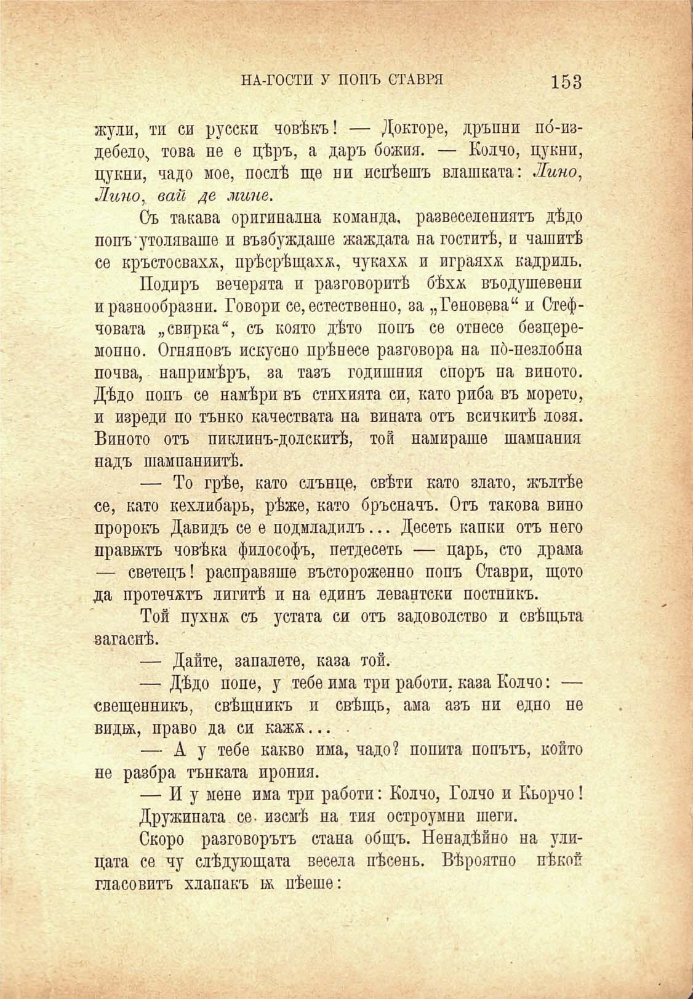

НА-ГОСТИ У ПОПЪ СТАВРЯ

153

жули, ти си русски човѣкъ! — Докторе, дръпни по́-издебело, това не е цѣръ, а даръ божия. — Колчо, пукни, Пукни, чадо мое, послѣ ще ни яснѣешъ влашката: Лина, Линог вай де мине.

Съ такава оригинална команда, развеселениятъ дѣдо попъ утоляваше и възбуждаше жаждата на гоститѣ, и чашитѣ се кръстосваха, прѣсрѣщаха, чукаха и играяхж кадрилъ.

Подиръ вечерята и разговоритѣ бѣхм въодушевени и разнообразни. Говори се, естественно, за „Геновева“ и Стефчовата „свирка“, съ която дѣто попъ се отнесе безцеремоппо. Огняновъ искусно прѣнесе разговора на по́-незлобна почва, напримѣръ, за тазъ годишния споръ на виното. Дѣдо попъ се намѣри въ стихията си, като риба въ морето, и изреди по тънко качествата на вината отъ всичкитѣ лозя. Виното отъ пиклинъ-долскитѣ, той намираше шампания надъ шампаниитѣ.

— То грѣе, като слънце, свѣти като злато, жълтѣе се, като кехлибаръ, рѣже, като бръсначъ. Отъ такова вино пророкъ Давидъ се е подмладилъ... Десеть капки отъ него правятъ човѣка философъ, петдесеть — царь, сто драма — светецъ! расправяше въстороженно попъ Ставри, щото да протечалъ лигитѣ и на единъ левантски постникъ.

Той пухнж съ устата си отъ задоволство и свѣщьта вагаснѣ.

— Дайте, запалете, каза той.

— Дѣдо поне, у тебе има три работи, каза Колчо: — свещеникъ, свѣщникъ и свѣщь, ама азъ ни едно не вида, право да си кажж... .

— Ду тебе какво има, чадо? попита попътъ, който не разбра тънката ирония.

— И у мене има три работи: Колчо, Голчо и Кьорчо!

Дружината се- изсмѣ на тия остроумни шеги.

Скоро разговорътъ стана общъ. Ненадѣйно на улицата се чу слѣдующата весела пѣсень. Вѣроятно нѣкой гласовитъ хлапакъ ж пѣеше:

