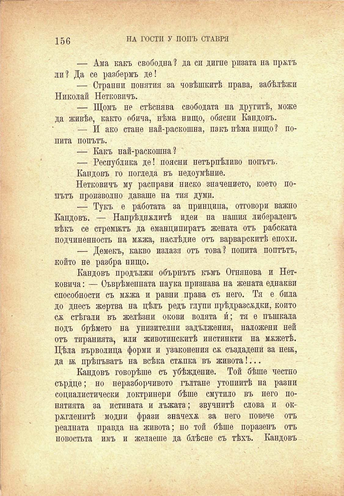

156

НА ГОСТИ У ПОПЪ СТАВРЯ

— Ама какъ свободна ? да си дигне ризата на пржтъ ли? Да се разбермъ де!

— Странни понятия за човѣшкитѣ права, забѣлѣжи Николай Нетковичъ.

— Щомъ не стѣснява свободата на другитѣ, може да живѣе, както обича, нѣма нищо, обясни Кандовъ.

— И ако стане най-раскошна, пакъ нѣма нищо? попита попътъ.

— Какъ най-раскошна?

— Республика де! поясни нетърпѣливо попътъ.

Кандовъ го погледа въ недоумѣние.

Нетковичъ му расправи ниско значението, което попътъ произволно даваше на тия думи.

— Тукъ е работата за принципа, отговори важно Кандовъ. — Напрѣдвалитѣ идеи на нашия либераленъ вѣкъ се стремилъ да еманципиратъ жената отъ рабската подчиненность на мжжа, наслѣдие отъ варварскитѣ епохи.

— Демекъ, какво излаза отъ това? попита поптътъ, който не разбра нищо.

Кандовъ продължи обърнътъ къмъ Огнянова и Нетковича: — Съврѣменната наука признава на жената еднакви способности съ мжжа и равни права съ него. Тя е била до днесъ жертва на цѣлъ редъ глупи прѣдразсждки, който сж стѣгали въ желѣзни окови волята и́; тя е пъшкала подъ брѣмето на унизителни задължения, наложени ней отъ тиранията, или животинскитѣ инстинкти на мжжетѣ. Цѣла върволица форми и узаконения сѫ създадени́ за нек, да ж прѣпъватъ на всѣка стжпка въ живота!...

Кандовъ говорѣше съ убѣждение. Той бѣше честно сърдце; но неразборчивото гълтане утопиитѣ на разни социалистически доктринери бѣше смутило въ него понятията за истината и лъжата; звучнитѣ слова и окржгленитѣ модни фрази значехж за него повече отъ реалната правда на живота; но той бѣше поразенъ отъ новостьта имъ и желаеше да блѣсне съ тѣхъ. Кандовъ

