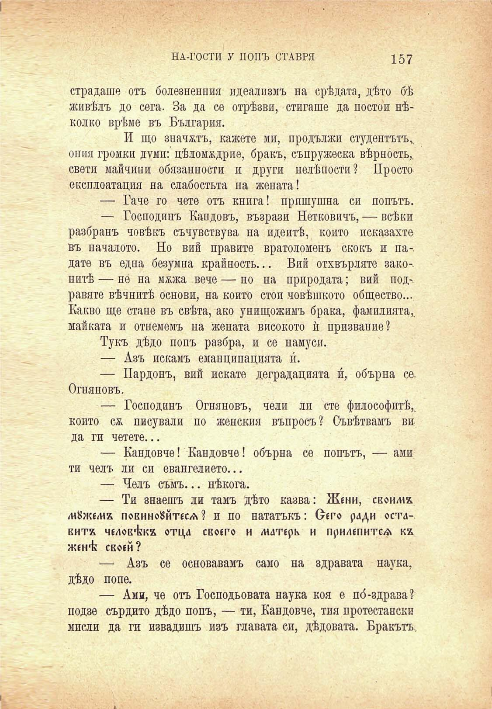

НА-ГОСТИ У ПОПЪ СТАВРЯ

157

страдаше отъ болезненпия идеализмъ на срѣдата, дѣто бѣ живѣлъ до сега. За да се отрѣзви, стигаше да постои нѣколко врѣме въ България.

И що значатъ, кажете ми, продължи студентътъ^ опия громки думи: цѣломѫдрие, бракъ, съпружеска вѣрность,, свети майчини обязанности и други нелѣпости? Просто експлоатация на слабостьта на жената!

— Гаче го чете отъ книга! пришушна си попътъ.

— Господинъ Кандовъ, възрази Нетковичъ, — всѣки разбранъ човѣкъ съчувствува на идеитѣ, който исказахте въ началото. Но вий правите вратоломепъ скокъ и падате въ една безумна крайность... Вий отхвърляте зако-. нитѣ — не на мжжа вече — но на природата; вий под-. равяте вѣчнитѣ основи, на който стои човѣшкото общество... Какво ще стане въ свѣта, ако унищожимъ брака, фамилията,, майката и отнемемъ на жената високото ѝ призвание?

Тукъ дѣдо попъ разбра, и се намуси.

— Азъ искамъ еманципацията п.

— Пардонъ, вий искате деградацията и́, обърна се. Огняновъ.

— Господинъ Огняновъ, чели ли сте философитѣ,, който сѫ писували по женския въпросъ? Съвѣтвамъ ви да ги четете...

— Кандовче! Кандовче! обърна се попътъ, — ами ти челъ ли си евангелието...

— Челъ съмъ... нѣкога.

— Ти знаешъ ли тамъ дѣто казва: Жени, свои/ие /и8же/иа повиноЗйтеса? и по нататъкъ: Оего ради оставите неловъкъ отца своего и матерк и прилепите^ кх женѣ: своей?

— Азъ се основавамъ само на здравата наука, дѣдо попе.

— Ами, че отъ Господьовата наука коя е по́-здрава? подзе сърдито дѣдо попъ, — ти, Кандовче, тия протестанти мисли да ги извадишъ изъ главата си, дѣдовата. Бракътъ.

