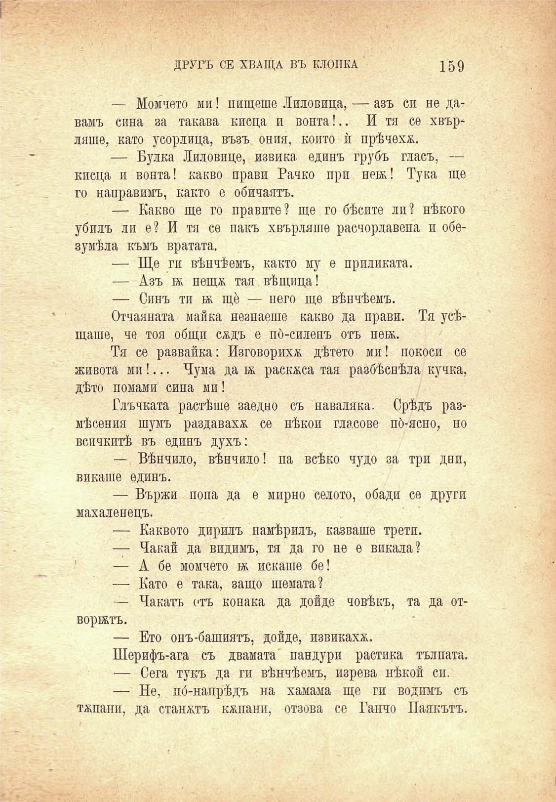

ДРУГЪ СЕ ХВАЩА ВЪ КЛОПКА

159

— Момчето ми! пищете Лиловица, — азъ си не давамъ сина за такава кисца и вонта!.. И тя се хвърляше, като усорлица, възъ ония, конто ѝ прѣчеха.

— Булка Лиловице, извика единъ грубъ гласъ, — кисца и вонта! какво прави Рачко при неж! Тука ще го направимъ, както е обичаятъ.

— Какво ще го правите? ще го бѣсите ли? нѣкого убилъ ли е? И тя се пакъ хвърляше расчорлавена и обезумѣла къмъ вратата.

— Ще ги вѣнчѣемъ, както му е приликата.

— Азъ а; нешл тая вѣщица!

— Синъ ти кк ще — него ще вѣнчѣемъ.

Отчаяната майка незнаеше какво да прави. Тя усѣщаше, че тоя общи сждъ е по́-силепъ отъ неж.

Тя се развайка: Изговорихѫ дѣтето ми! покоси се живота ми!... Чума да б& раскжса тая разбѣснѣла кучка, дѣто помами сина ми!

Глъчката растѣше заедно съ наваляна. Срѣдъ размѣсения шумъ раздаваха се нѣкои гласове по́-ясно, но всичкитѣ въ единъ духъ:

— Вѣнчило, вѣнчило! па всѣко чудо за три днп, викаше единъ.

— Вържи попа да е мирно селото, обади се други махаленецъ.

— Каквото дирилъ намѣрилъ, казваше трети.

— Чакай да видимъ, тя да го не е викала?

— А бе момчето к; искаше бе!

— Като е така, защо темата?

— Чакатъ отъ конака да дойде човѣкъ, та да отворжтъ.

— Ето онъ-башиятъ, дойде, извикаха.

Шерифъ-ага съ двамата пандури растика тълпата.

— Сега тукъ да ги вѣнчѣемъ, изрева нѣкой си.

— Не, по́-напрѣдъ на хамама ще ги водимъ съ тепани, да станатъ капани, отзова се Ганчо Паякътъ.

