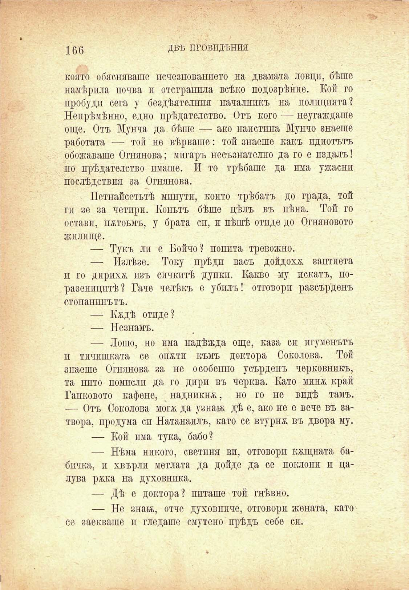

166

ДВѢ ПРОВИДЕНИЯ

която обясняваше псчезнованпето на двамата ловци, бѣше намѣрпла почва и отстранила всѣко подозрѣнпе. Кои го пробуди сега у бездѣятелнпя началникъ на полицията? Непрѣмѣнно, едно прѣдателство. Отъ кого — неугаждаше още. Отъ Мунча да бѣше — ако наистина Мунчо знаеше работата — той не вѣрваше: той знаеше какъ идиотътъ обожаваше Огнянова; мигаръ несъзнателно да го е издалъ! но прѣдателство имаше. И то трѣбаше да пма ужасни послѣдствия за Огнянова.

Петнайсетьтѣ минути, конто трѣбатъ до града, той ги зе за четири. Коньтъ бѣше цѣлъ въ пѣна. Той го остави, пжтоьмъ, у брата сп, и пѣшѣ отиде до Огняновото жилище.

— Тукъ ли е Бойчо? попита тревожно.

— Излѣзе. Току прѣди васъ дойдохѫ заптиета п го дирихж. изъ спчкптѣ дупки. Какво му пекатъ, поразеницитѣ? Гаче челѣкъ е убилъ! отговори разсърденъ стопанинътъ.

— Кждѣ отиде?

— Незнамъ.

— Лошо, но пма надѣжда още, каза си игуменътъ п тичпшката се опж.тп къмъ доктора Соколова. Той знаеше Огнянова за не особенно усърденъ черковникъ, та нито помисли да го дири въ черква. Като мин& край Танковото кафене, надникна, но го не видѣ тамъ. — Отъ Соколова мога; да узнай; дѣ е, ако не е вече въ затвора, продума си Натанаилъ, като се втурна въ двора му.

— Кой пма тука, бабо?

— Нѣма никого, светиня ви, отговори кѫщната бабичка, и хвърли метлата да дойде да се поклони и цалува ржка на духовника.

— Дѣ е доктора? питаше той гнѣвно.

— Но знак, отче духовниче, отговори жената, като се заекваше и гледаше смутено прѣдъ себе си.

