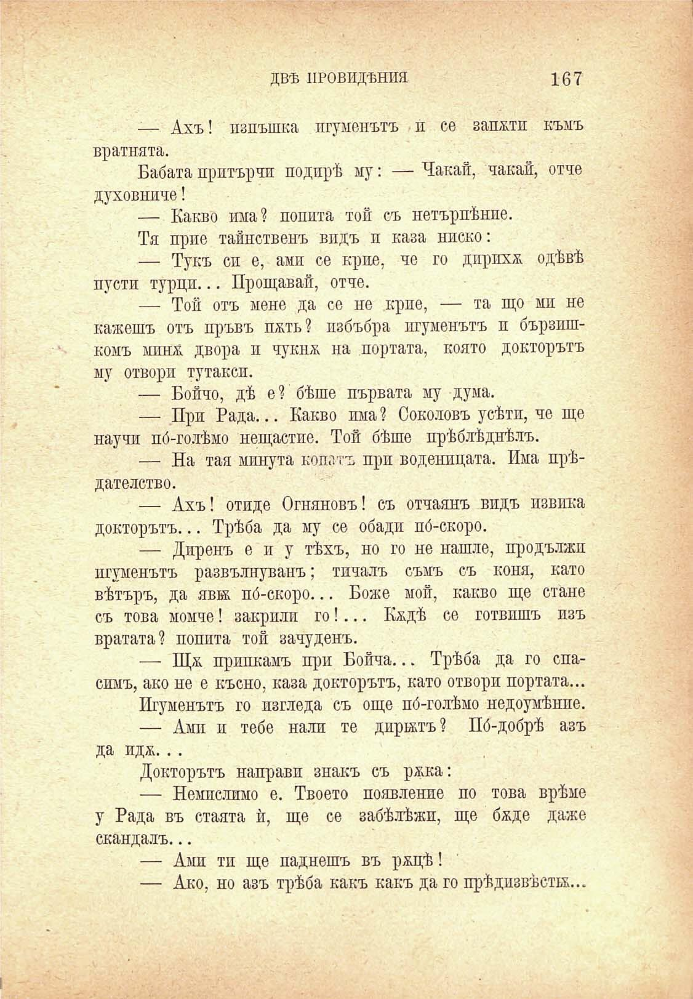

ДВѢ ПРОВИДѢНИЯ

167

-— Ахъ! изпъшка игуменътъ и се запоти къмъ вратнята.

Бабата притърчи подпрѣ му: — Чакай, чакай, отче духовниче!

— Какво има? попита той съ нетърпѣнпе.

Тя прие тайнственъ видъ и каза ниско:

— Тукъ си е, ами се крие, че го дприхх. одѣвѣ пусти турци... Прощавай, отче.

— Той отъ мене да се не крие, — та що мп не кажешъ отъ пръвъ пжть? избъбря игуменътъ и бързишкомъ минж двора и чукнж на портата, която докторътъ му отворп тутакси.

— Бойчо, дѣ е ? бѣше първата му дума.

— При Рада... Какво пма? Соколовъ усѣти, че ще научи по́-голѣмо нещастие. Той бѣше прѣблѣднѣлъ.

— На тая минута копатъ при воденицата. Има прѣдателство.

— Ахъ! отиде Огняновъ! съ отчаянъ видъ извика докторътъ... Трѣба да му се обади по́-скоро.

— Диренъ е и у тѣхъ, но го не нашле, продължи игуменътъ развълнуванъ; тичалъ съмъ съ коня, като вѣтъръ, да яви по́-скоро... Боже мой, какво ще стане съ това момче! закрили го!... К&дѣ се готвишъ изъ вратата? попита той зачуденъ.

— Щж припкамъ при Бойча... Трѣба да го спасимъ, ако не е късно, каза докторътъ, като отвори портата...

Игуменътъ го изгледа съ още по́-голѣмо недоумѣнпе.

— Амп и тебе нали те дирилъ? Пб-добрѣ азъ да идж...

Докторътъ направи знакъ съ ржка:

— Немислимо е. Твоето появление по това врѣме у Рада въ стаята ѝ, ще се забѣлѣжи, ще бѫде даже скандалъ...

— Ами тп ще паднешъ въ ржцѣ!

— Ако, но азъ трѣба какъ какъ да го прѣдизвѣсти...

