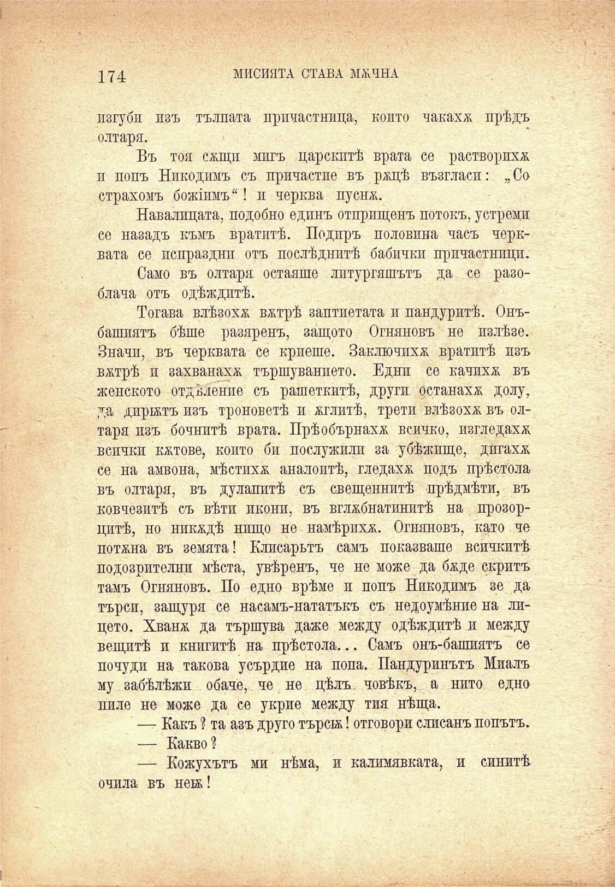

174	МИСИЯТА СТАВА МХЧНА

изгуби изъ тълпата причастница, конто чакахж прѣдъ олтари.

Въ тоя сжщп мигъ царскитѣ врата се растворпхя п попъ Никодимъ съ причастие въ ряцѣ възгласи: „Со страхомъ божшмъ“! и черква пусия.

Навалицата, подобно единъ отприщенъ потокъ, устреми се назадъ къмъ вратитѣ. Подиръ половина часъ черквата се испраздни отъ послѣднитѣ бабички причастници.

Само въ олтара остаяше литургяшътъ да се разоблача отъ одѣждптѣ.

Тогава влѣзохѫ вятрѣ заптиетата и пандуритѣ. Онъбашиятъ бѣше разяренъ, защото Огняновъ не излѣзе. Значи, въ черквата се криеше. Заключихѫ вратитѣ изъ вятрѣ и захванаха тършуванпето. Едни се качихж въ женското отдѣление съ рашеткитѣ, други останаха долу, да дирятъ изъ троноветѣ и жглитѣ, трети влѣзохя въ олтара изъ бочнитѣ врата. Прѣобърнаха всичко, изгледаха всички кятове, който би послужилп за убѣжище, дпгахя се на амвона, мѣстихѫ аналоитѣ, гледахя подъ прѣстола въ олтара, въ дулапитѣ съ свещеннитѣ прѣдмѣти, въ ковчезитѣ съ вѣти икони, въ вглжбнатинитѣ на прозорцитѣ, но никядѣ нищо не намѣриха. Огнановъ, като че потжна въ земата! Клисарьтъ самъ показваше всичкитѣ подозрителни мѣста, увѣренъ, че не може да бхде скритъ тамъ Огнановъ. По едно врѣме и попъ Никодимъ зе да търси, защура се насамъ-нататъкъ съ недоумѣние на лицето. Хванж да тършува даже между одѣждитѣ и между пещитѣ и книгитѣ на прѣстола... Самъ онъ-башиатъ се почуди на такова усърдие на попа. Пандуринътъ Миалъ му забѣлѣжи обаче, че не цѣлъ, човѣкъ, а нито едно пиле не може да се укрие между тиа нѣща.

—- Какъ ? та азъ друго търси! отговори слисанъ попътъ. — Какво?

— Кожухътъ ми нѣма, и калимавката, и синитѣ, очила въ нен!

а

