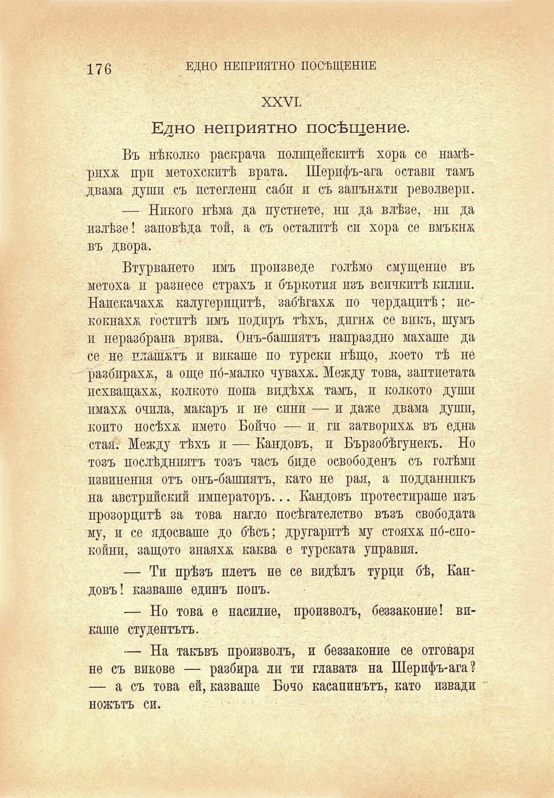

176

ЕДНО НЕПРИЯТНО ПОСЕЩЕНИЕ

XXVI.

Едно неприятно посещение.

Въ нѣколко раскрача полицейскитѣ хора се намѣрпхж при метохскптѣ врата. Шерифъ-ага остави тамъ двама души съ пстегленп саби и съ запъюкти револверп.

— Никого нѣма да пустнете, ни да влѣзе, ни да излѣзе! заповѣда той, а съ осталптѣ си хора се вмъкна въ двора.

Втурването имъ произведе голѣмо смущение въ метоха и разнесе страхъ и бъркотия изъ всичкитѣ килни. Надскачаха калугерицитѣ, забѣгаха по чердацитѣ; искокнахж гоститѣ имъ подиръ тѣхъ, дпгнж се викъ, шумъ и неразбрана врява. Онъ-башиятъ напраздно махаше да се не плашатъ и викаше по турски нѣщо, което тѣ не разбираха, а още по́-малко чуваха. Между това, заптиетата похващаха, колкото попа видѣха тамъ, и колкото души имахх очила, макаръ и не сини — и даже двама души, конто носѣха името Бойчо — и. ги затворихѫ въ една стая.- Между тѣхъ и — Кандовъ, и Бързобѣгунекъ. Но тозъ послѣдниятъ тозъ часъ биде освободенъ съ голѣми извинения отъ онъ-башиятъ, като не рая, а подданникъ на австрийский императоръ... Кандовъ протестираше изъ прозорцитѣ за това нагло посѣгателство възъ свободата му, и се ядосваше до бѣсъ; другаритѣ му стояхж по́-спокойни, защото знаяха каква е турската управия.

— Ти прѣзъ плетъ не се видѣлъ турци бѣ, Кандовъ! казваше единъ попъ.

— Но това́ е насилие, произволъ, беззаконие! викаше студентътъ.

— На такъвъ произволъ, и беззаконие се отговаря не съ викове — разбира ли ти главата на Шерифъ-ага? — а съ това ей, казваше Бочо касапинътъ, като извади

ножътъ си.

