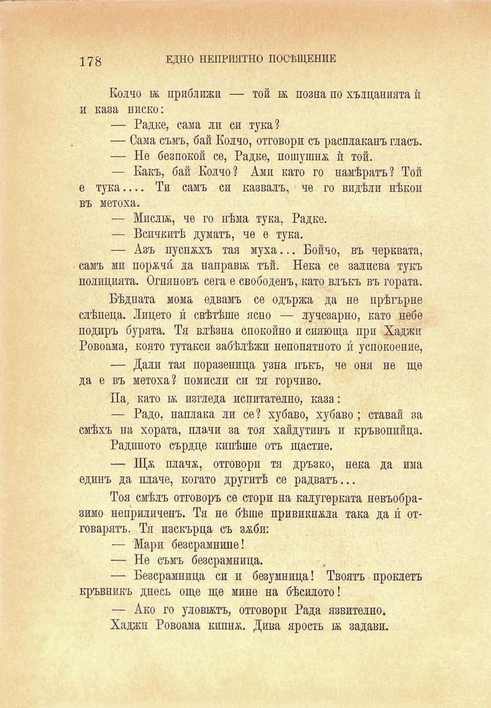

178

ЕДНО НЕПРИЯТНО ПОСЕЩЕНИЕ

Колчо ж приближи — той ж позна по хълцанията ѝ и каза ниско:

— Радке, сама ли си тука?

— Сама съмъ, бай Колчо, отговори съ расплаканъ гласъ.

— Не безпокой се, Радке, пошушна ѝ той.

— Какъ, бай Колчо? Ами като го намѣрятъ? Той е тука.... Ти самъ си казвалъ, че го видѣли нѣкои въ метоха.

— Мисли;, че го нѣма тука, Радке.

— Всичкитѣ думатъ, че е тука.

— Азъ пуснахъ тая муха... Бойчо, въ черквата, самъ ми порачи́ да направи; тъй. Нека се залисва тукъ полицията. Огняновъ сега е свободенъ, като влъкъ въ гората.

Бѣдната мома едвамъ се одържа да не прѣгърне слѣпеца. Лицето и́ свѣтѣше ясно — лучезарно, като небе подиръ бурята. Тя влѣзна спокойно и сияюща при Хаджи Ровоама, която тутакси забѣлѣжи непонятното и́ успокоение, — Дали тая поразеница узна пъкъ, че оня не ще да е въ метоха? помисли си тя горчиво.

Па? като м; изгледа непитателно, каза:

— Радо, наплака ли се? хубаво, хубаво; ставай за смѣхъ на хората, плачи за тоя хайдутинъ и кръвопийци.

Радиното сърдце кипѣше отъ щастие.

— Ща плача, отговори тя дръзко, пека да има единъ да плаче, когато другитѣ се радватъ...

Тоя смѣлъ отговоръ се стори на калугерката невъобразимо неприличенъ. Тя не бѣше привиквала така да и́ отговарятъ. Тя изскърца съ заби:

— Мари безсрамнице!

— Не съмъ безсрамница.

— Безсрамница си и безумница! Твоятъ проклетъ кръвникъ днесъ още ще мине на бѣсилото!

— Ако го уловътъ, отговори Рада язвително.

Хаджи Ровоама кипна. Дива ярость 1а задави.

