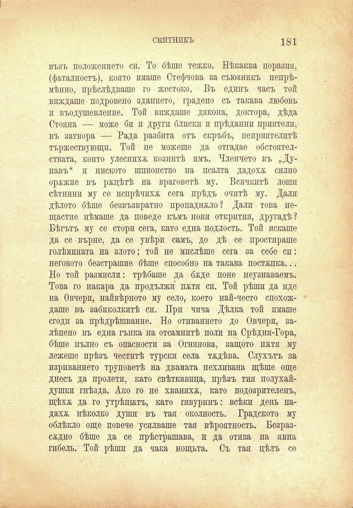

скитникъ

181

възъ положението си. То бѣше тежко. Нѣкаква поразия, (фаталность), която имаше Стефчова за съюзникъ непрѣмѣнно, прѣслѣдваше го жестоко. Въ единъ часъ той виждаше подровено зданието, градено съ такава любовь и въодушевление. Той виждаше дякона, доктора, дѣда Стояна — може би и други блпскп и прѣданий приятели, въ затвора — Рада разбита отъ скръбь, неприятелитѣ тържествующп. Той не можеше да отгадае обстоятелствата, конто улеснихѫ козлитѣ имъ. Членчето въ „Дунавъ“ и ниското шпионство на псалта дадохѫ силно орѫжие въ рѫцѣтѣ на враговетѣ му. Всичкитѣ лоши сѣтнпни му се попрѣчихѫ сега прѣдъ очитѣ му. Дали дѣлото бѣше безвъзвратно пропаднжло? Дали това нещастпе нѣмаше да поведе къмъ нови открития, другадѣ ? Бѣгътъ му се стори сега, като една подлость. Той искаше да се върне, да се увѣри самъ, до дѣ се простираше голѣмината на злото; той не мислѣше сега за себе сп: неговото безстрашие бѣше способно на такава постѫпка... Но той размисли: трѣбаше да баде поне неузнаваемъ. Това го накара да продължи патя си. Той рѣши да иде на Овчери, найвѣрното му село, което най-често спохождаше въ забиколкитѣ си. при чпча Дѣлка той имаше сгоди за прѣдрѣшвание. Но отиванието до Овчери, залѣпено въ една гънка на отсамнитѣ поли на Срѣдня-Гора, бѣше пълно съ опасности за Огнянова, защото пмтя му лежеше прѣзъ честитѣ турски села вдѣва. Слухътъ за изриванието труповетѣ на двамата пехливана щѣше още днесъ да пролети, като свѣткавица, прѣзъ тия полухайдушки гнѣзда. Ако го не хваняхѫ, като подозрителенъ, щѣхѫ да го утрѣпѭтъ, като гявуринъ: всѣки день падахж нѣколко души въ тая околность. Градското му облѣкло още повече усилваше тая вѣроятность. Безразсмдно бѣше да се прѣстрашава, и да отива на явна гибель. Той рѣши да чака нощьта. Съ тая цѣлъ се

