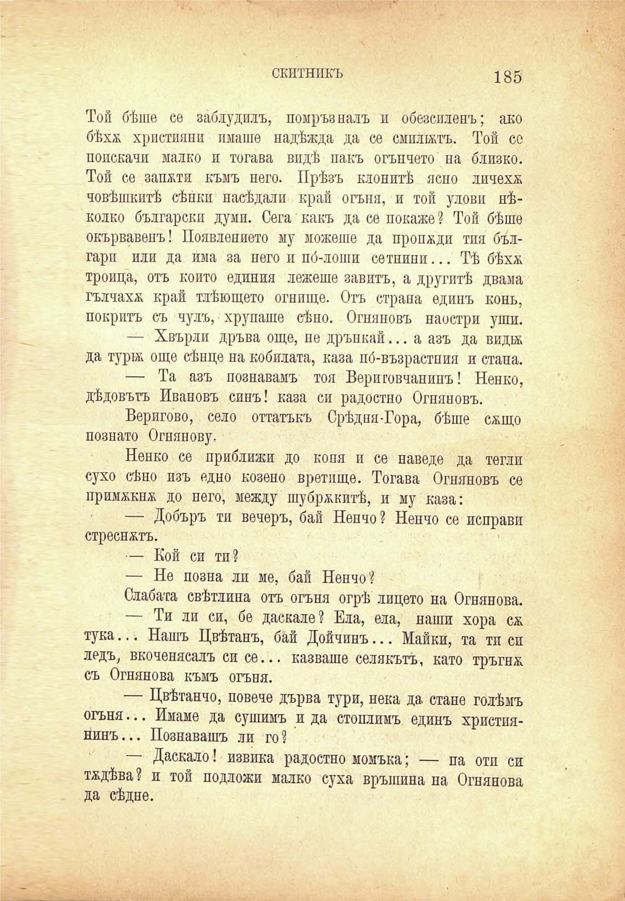

скитникъ	185

Той бѣше се заблудилъ, помръзналъ и обезсиленъ; ако бѣхх християни имаше надѣжда да се смилатъ. Той со поискачи малко и тогава видѣ пакъ огъпчето на близко. Той се запоти къмъ него. Прѣзъ клонитѣ ясно личеха човѣшкитѣ сѣнки пасѣ дали край огъня, и той улови нѣколко български думи. Сега какъ да се покаже? Той бѣше окървавенъ! Появлението му можеше да пропжди тия българп или да има за него и по́-лоши сетнипп... Тѣ бѣхж троица, отъ който единия лежеше завитъ, а другитѣ двама гълчаха; край тлѣющето огнище. Отъ страна единъ конь, покритъ съ чулъ, хрупаше сѣно. Огняновъ наостри уши.

— Хвърли дръва още, не дрънкай... а азъ да вида да тура още сѣнце па кобилата, каза по́-възрастпия и етапа.

— Та азъ познавамъ тоя Вериговчапииъ! Ненко, дѣдовътъ Ивановъ синъ! каза си радостно Огняновъ.

Веригово, село оттатъкъ Срѣдни-Гора, бѣше сжщо познато Огнянову.

Ненко се приближи до коня и се наведе да тегли сухо сѣно изъ едно козено вретище. Тогава Огняновъ се примжкпж до него, между шубржкитѣ, и му каза:

— Добъръ ти вечерь, бай Ненчо? Ненчо се неправи стреенжтъ.

— Кой си ти?

— Не позна ли ме, бай Ненчо?

Слабата свѣтлина отъ огъня огрѣ лицето на Огнянова.

— Ти ли си, бе даскале? Ела, ела, наши хора сж. тука... Нашъ Цвѣтанъ, бай Дойчинъ... Майки, та ти си ледъ, вкоченясалъ си се... казваше селякътъ, като тръгнж съ Огнянова къмъ огъня.

— Цвѣтанчо, повече дърва тури, нека да етане голѣмъ огъня... Имаме да сушимъ и да стоплимъ единъ християнинъ... Познавашъ ли го?

— Даекало! извика радостно момъка; — па отп си тѫдѣва? и той подложи малко суха връшина на Огнянова да сѣдне.

