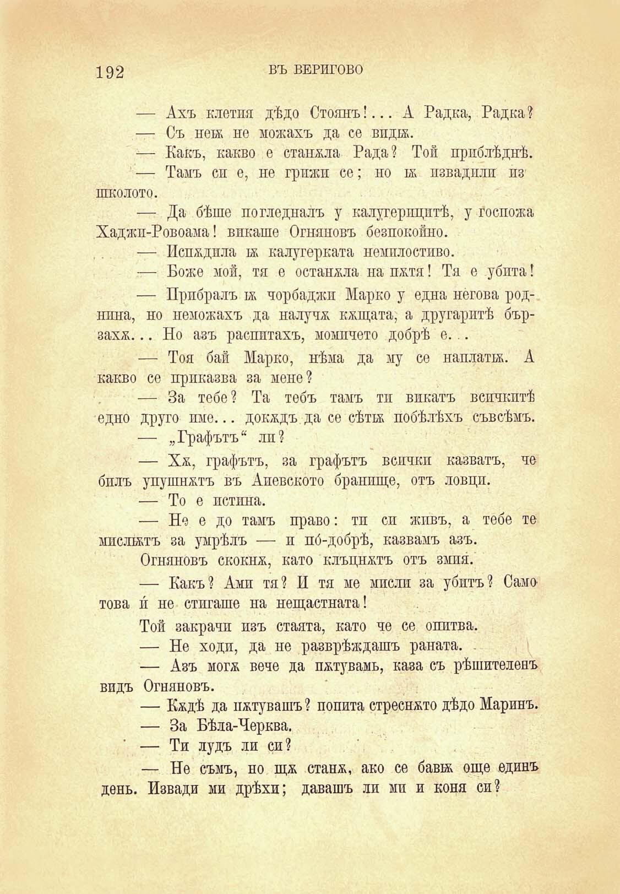

192

ВЪ ВЕРИГОВО

— Ахъ клетия дѣдо Стоянъ!... А Радка, Радка?

— Съ нен не можахъ да се впдгх.

— Какъ, какво е стапяла Рада? Той приблѣднѣ.

— Тамъ си е, не грижи се; но тя пзвадпли пз школото.

— Да бѣше погледналъ у калугерпцптѣ, у госпожа Хаджп-Ровоама! викаше Огняновъ безпокойно.

— Испядпла тя калугерката немилостиво.

— Боже мой, тя е оставяла на пятя! Тя е убита!

— Прибралъ тя чорбаджи Марко у една негова роднпна, но неможахъ да налучя кящата, а другаритѣ бързахя... Но азъ распптахъ, момичето добрѣ е...

— Тоя бай Марко, нѣма да му се наплати;. А какво се приказва за меле?

— За тебе? Та тебъ тамъ тп викатъ всичкитѣ едно друго име... докядъ да се сѣттх побѣлѣхъ съвсѣмъ.

— „Графътъ“ лп?

— Хя, графътъ, за графътъ всички казватъ, че билъ упушнятъ въ Апевското бранище, отъ ловци.

— То е истина.

— Не е до тамъ право: тп си живъ, а тебе те мислилъ за умрѣлъ — и по́-добрѣ, казвамъ азъ.

Огняновъ скокня, като КЛЪЦНАЛЪ отъ змия.

— Какъ? Амп тя? и тя ме мисли за убитъ? Само това и не стигаше на нещастната!

Той закрачи изъ стаята, като че се опитва.

— Не ходи, да не разврѣждашъ раната. .

— Азъ могх вече да пхтувамь, каза съ рѣшителенъ видъ Огняновъ.

— Кядѣ да пхтувашъ? попита стреснято дѣдо Маринъ.

— За Бѣла-Черква.

— Ти лудъ ли си?

— Не съмъ, но щя станх, ако се бави още единъ день. Извади ми дрѣхи; давашъ ли мп и коня си?

