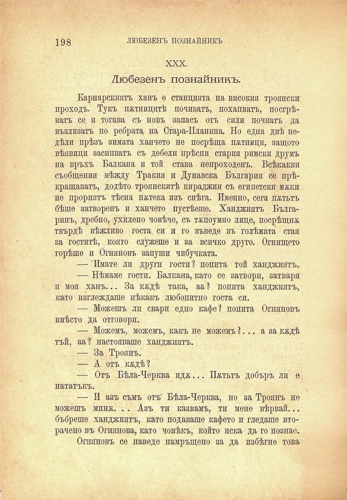

198

ЛЮБЕЗЕНЪ ПОЗНАЙНИКЪ

XXX.

Любезенъ познайникъ.

Карнарскията ханъ е станцията па високия троянски проходъ. Тукъ потницитѣ попиватъ, похапватъ, посгрѣватъ се. и тогава съ новъ запасъ отъ сили почватъ да възлизатъ по ребрата на Стара-Планина. Но една двѣ недѣли прѣзъ зимата ханчето не посрѣща потници, защото вѣявици засипватъ съ дебели прѣспи стария римски друмъ на връхъ Балкана и той става непроходенъ. Всѣкакви съобщения мѣжду Тракия и Дунавска България се прѣкращаватъ, додѣто троянскитѣ кираджии съ египетски мжки не прориятъ тѣсна потека изъ снѣга. Именно, сега пѫтьтъ бѣше затворенъ и ханчето пустѣеше. Ханджията Българинъ, дребно, ухилено човѣче, съ тѫпоумно лице, посрѣщна твърдѣ вѣжливо госта си и го въведе въ голѣмата стая за гоститѣ, която служеше и за всичко друго. Огнището горѣше и Огняновъ запуши чибучката.

— 'Имате ли други гости? попита той ханджията.

— Нѣмаме гости. Балкана, като се затвори, затваря п моя ханъ... За кждѣ така, аа ? попита ханджиятъ, като изглеждаше нѣкакъ любопитно госта си.

— Можешъ ли свари едно кафе? попита Огняновъ вмѣсто да отговори.

— Можемъ, можемъ, какъ не можемъ ?... а за кждѣ тъй, аа? настояваше ханджиятъ.

— За Троянъ.'

— А отъ кждѣ?

— Отъ Бѣла-Черква ида... Пѫтьтъ добъръ ли е нататъкъ.

— И азъ съмъ отъ Бѣла-Черква, но за Троянъ не можешъ мпнж. •. . Азъ ти казвамъ, ти мене вѣрвай... бъбреше ханджиятъ, като подаваше кафето и гледаше вторачено въ Огнянова, като човѣкъ, който иска да го познае.

Огняновъ се наведе намръщено за да избѣгне това

