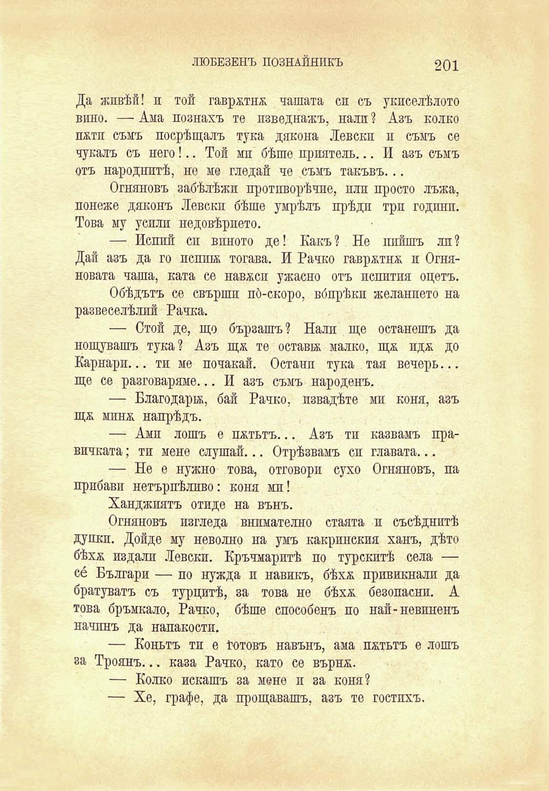

ЛЮБЕЗЕНЪ ПОЗНАЙНИКЪ

201

Да живѣй! и той гаврятня чашата си съ укпселѣлото вино. — Ама познахъ те пзведнажъ, нали ? Азъ колко пятп съмъ посрѣщалъ тука дякона Левски и съмъ се чукалъ съ него!.. Той мп бѣше приятель... И азъ съмъ отъ народнитѣ, не ме гледай че съмъ такъвъ...

Огняновъ забѣлѣжи протпворѣчие, или просто лъжа, понеже дяконъ Левскп бѣше умрѣлъ прѣди три години. Това му усили недовѣрието.

— Исппй си виното де! Какъ ? Не ппйшъ ли ? Дай азъ да го исшпж тогава. И Рачко гаврхтня и Огняновата чаша, ката се навеси ужасно отъ испития оцетъ.

Обѣдътъ се свършп по́-скоро, вбпрѣкп желанпето на развеселѣлъ Рачка.

— Стой де, що бързашъ? Нали ще останешъ да нощувашъ тука? Азъ щя те остави; малко, щя идя до Карнари... ти ме почакай. Останп тука тая вечерь... ще се разговаряме... И азъ съмъ народенъ.

— Благодари;, бай Рачко, пзвадѣте ми коня, азъ щя миня напрѣдъ.

—- Ами лошъ е пѫтьтъ... Азъ тп казвамъ правичката; ти мене слушай... Отрѣзвамъ си главата...

— Не е нужно това, отговори сухо Огняновъ, па прибави нетърпѣливо: коня мп!

Ханджиятъ отиде на вънъ.

Огняновъ изгледа внимателно стаята и съсѣднитѣ дупки. Дойде му неволно на умъ какринския ханъ, дѣто бѣхя издали Левски. Кръчмаритѣ по турскитѣ села — се Българи — по нужда и навикъ, бѣхя привиквали да братуватъ съ турцитѣ, за това не бѣхя безопасни. А това бръмкало, Рачко, бѣше способенъ по най-невиненъ начинъ да напакости.

— Коньтъ ти е Готовъ навънъ, ама пѫтьтъ е лошъ за Троянъ... каза Рачко, като се кърпя.

— Колко искашъ за мене и за коня?

— Хе, графе, да прощавашъ, азъ те гостихъ.

