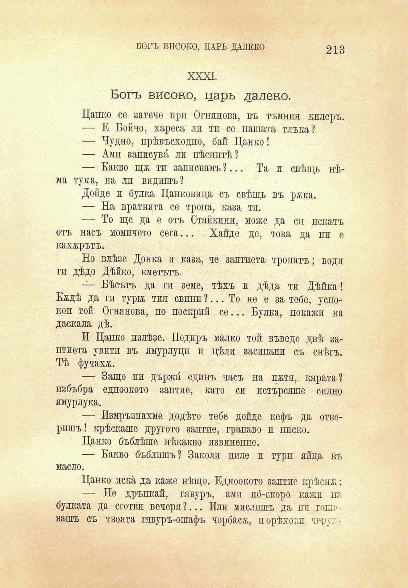

БОГЪ ВИСОКО, ЦАРЬ ДАЛЕКО

213

XXXI.

Богъ високо, царь далеко.

Цанко се затече при Огнянова, въ тъмния килеръ.

— Е Бончо, хареса ли тп се нашата тлъка?

— Чудно, прѣвъсходно, бай Цанко!

— Ами заппсувй ли пѣснитѣ?

— Какво шд тп записвамъ ?... Та и свѣщь нѣма тука, на ли видишъ?

Дойде и булка Цанковица съ свѣщь въ ржка.

— На вратнята се тропа, каза тя.

— То ще да е отъ Стайкпнп, може да си искатъ отъ насъ момичето сега... Хайде де, това да ни е кахърътъ.

Но влѣзе Донка и каза, че заптиета тропатъ; води ги дѣдо Дѣйко, кметътъ.

— Бѣсътъ да ги земе, тѣхъ и дѣда ти Дѣйка! Кждѣ да ги тури тия евини ?... То не е за тебе, успокоп той Огнянова, но поскрий се... Булка, покажи на даскала дѣ.

И Цанко излѣзе. Подиръ малко той въведе двѣ заптиета увити въ ямурлуци и цѣли заеипани съ снѣгъ. Тѣ фучахж.

— Защо ни държа единъ часъ на пжтя, кярата? избъбра едноокото заптие, като си истърсяше силно ямурлука.

— Измръзнахме додѣто тебе дойде кефъ да отворишъ! крѣскаше другото заптие, грапаво и ниско.

Цанко бъблѣше нѣкакво извинение.

— Какво бъблишъ? Заколи пиле и тури яйца въ масло.

Цанко иска да каже нѣщо. Едноокото заптие крѣсна:

— Не дрънкай, гявуръ, ами по́-скоро кажи не булката да сготви вечеря?... Или мислишъ да ни гош:вашъ съ твоята гявуръ-ошафъ чорбасж, порѣхови черуг

