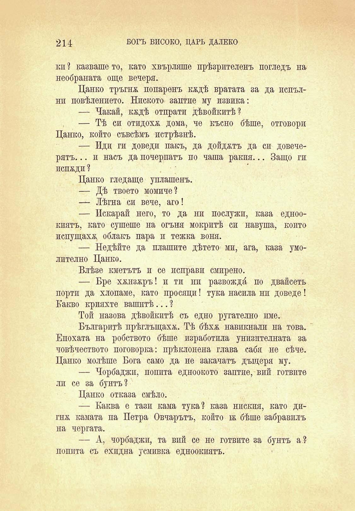

214

БОГЪ ВИСОКО, ЦАРЬ ДАЛЕКО

кп ? казваше то, като хвърляше прѣзрителенъ погледъ на необраната още вечеря.

Цанко тръгна попаренъ кждѣ вратата за да непълни повѣлението. Ниското заптие му извика:

— Чакай, кждѣ отпрати дѣвойкитѣ?

— Тѣ ей отидохѫ дома, че късно бѣше, отговори Цанко, който съвсѣмъ истрѣзнѣ.

— Иди ги доводи пакъ, да дойдатъ да си довечерятъ. .. и насъ да почерпатъ по чаша ракия... Защо ги испждп ?

Цанко гледаще уплашенъ.

— Дѣ твоето момиче?

— Лѣтна си вече, аго!

— Искарай него, то да ни послужи, каза едноокиятъ, като сушеше на огъня мокритѣ си навуща, който испущахж. облакъ пара и тежка воня.

— Недѣйте да плашите дѣтето ми, ага, каза умолително Цанко.

Влѣзе кметътъ и се неправи смирено.

— Бре ххнзжръ! и ти ни развождй по двайсеть порти да хлопаме, като просяци! тука насила ни доводе 1 Какво крияхте вашитѣ... ?

Той назова дѣвойкитѣ съ едно ругателно име.

Българитѣ прѣглъщаха. Тѣ бѣхѫ навиквали на това. Епохата на робството бѣше изработпла унизителната за човѣчеството поговорка: прѣклонена глава сабя не сѣче. Цанко молѣше Бога само да не закачатъ дъщеря му.

— Чорбаджи, попита едноокото заптие, вий готвите лп се за бунтъ?

Цанко отказа смѣло.

— Каква е тази кама тука? каза ниския, като дигиж камата па Петра Овчарьтъ, който ек бѣше забравилъ на чергата.

— А, чорбаджи, та впй се не готвите за бунтъ а ? попита съ ехидна усмивка едноокиятъ.

