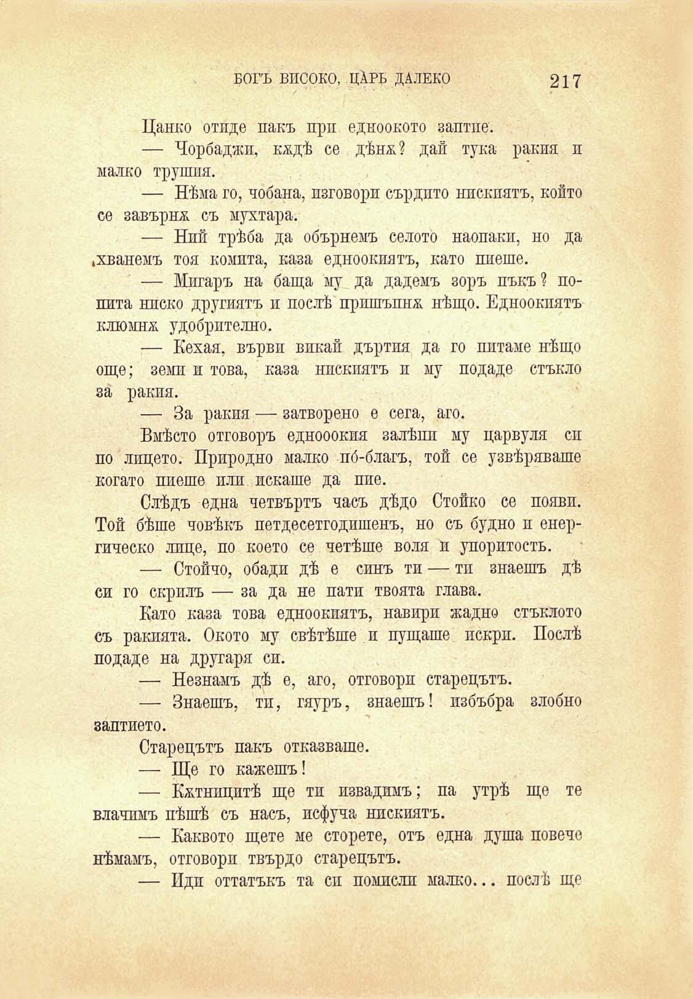

БОГЪ ВИСОКО, ЦАРЬ ДАЛЕКО	217

Цанко отиде пакъ при едноокото заптие.

— Чорбаджи, кждѣ се дѣнж? дай тука ракия п малко трушпя.

— Нѣма го, чобана, изговори сърдито нискиятъ, който се завърна съ мухтара.

— Ний трѣба да обърнемъ селото наопаки, но да ^хванемъ тоя комита, каза едноокиятъ, като пиеше.

— Мигаръ на баща му да дадемъ зоръ пъкъ? попита ниско другиятъ и послѣ пришъпнх нѣщо. Едноокиятъ клюмна удобрително.

— Нехая, върви викай дъртия да го питаме нѣщо още; земи и това, каза нискиятъ и му подаде стъкло за ракия.

— За ракия — затворено е сега, аго.

Вмѣсто отговоръ еднооокпя залѣпп му царвуля си по лицето. Природно малко по́-благъ, той се узвѣряваше когато пиеше или искаше да пие.

Слѣдъ една четвърть часъ дѣдо Стойко се появи. Той бѣше човѣкъ петдесетгодишенъ, но съ будно и енергическо лице, по което се четѣше воля и упоритость.

— Стойчо, обади дѣ е синъ ти — тп знаешъ дѣ си го скрилъ — за да не пати твоята глава.

Като каза това едноокиятъ, навири жадно стъклото съ ракията. Окото му свѣтѣше и пущаше пскрп. Послѣ подаде на другаря си.

— Незнамъ дѣ е, аго, отговори старецътъ.

— Знаешъ, тп, гяуръ, знаешъ! пзбъбра злобно заптието.

Старецътъ пакъ отказваше.

— Ще го кажешъ!

— Кѫтницитѣ ще тп извадимъ; па утрѣ ще те влачпмъ пѣшѣ съ насъ, псфуча нискиятъ.

— Каквото щете ме сторете, отъ една душа повече нѣмамъ, отговори твърдо старецътъ.

— Идп оттатъкъ та си помисли малко... послѣ ще

