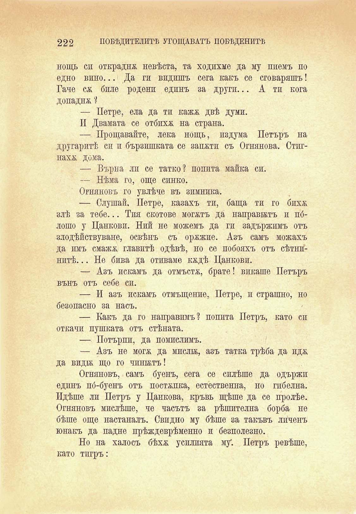

222

ПОБѢДИТЕЛИТѢ УГОЩАВАТЪ ПОБѢДЕНИТѢ

нощь си открадна невѣста, та ходихме да му пиемъ по едно вино... Да ги видишъ сега какъ се сговаряшъ! Гаче сѫ биле родени едпнъ за други... А тп кога допадня ?

— Петре, ела да тп кажя двѣ думи.

И Двамата се отбихя на страна.

— Прощавайте, лека нощь, издума Петъръ на другаритѣ си и бързишката се запяти съ Огнянова. Стшнахя дома.

— Върна ли се татко? попита майка си.

— Нѣма го, още синко.

Огняновъ го увлѣче въ зимника.

— Слушай, Петре, казахъ ти, баща ти го бихя злѣ за тебе... Тия скотове могятъ да направятъ и пблошо у Цанкови. Ний не можемъ да ги задържимъ отъ злодѣйствуване, освѣнъ съ оряжие. Азъ самъ можахъ да имъ смажя главитѣ одѣвѣ, но се побояхъ отъ сѣтнинитѣ... Не бива да отиваме кядѣ Цанкови.

— Азъ искамъ да отмъстя, брате! викаше Петъръ вънъ отъ себе сп.

— И азъ искамъ отмъщение, Петре, и страшно, но безопасно за насъ.

— Какъ да го направимъ? попита Петръ, като сп откачи пушката отъ стѣната.

— Потърпи, да помислимъ.

— Азъ не могя да мисли, азъ татка трѣба да идя да види що го чинилъ!

Огняновъ, самъ буенъ, сега се силѣше да одържп едпнъ по́-буенъ отъ постѫпка, естествения, но гибелна. Идѣше ли Петръ у Цанкова, кръвь щѣше да се пролѣе. Огняновъ мислѣше, че часътъ за рѣшителна борба не бѣше още настаналъ. Свидно му бѣше за такъвъ личенъ юнакъ да падне прѣждеврѣменно и безполезно.

Но на халосъ бѣхя усилията му*. Петръ ревѣше, като тпгръ:

