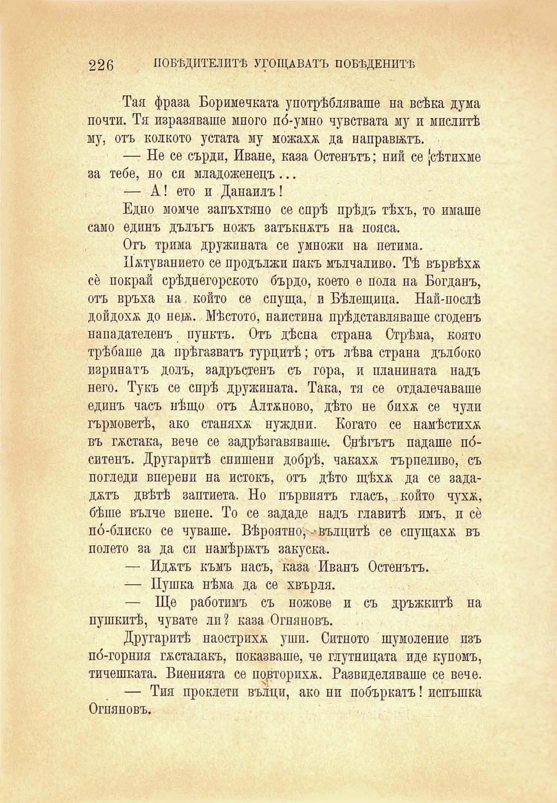

226

ПОБѢДИТЕЛИТѢ УГОЩАВАТЪ ПОБѢДЕНИТѢ

Тая фраза Боримечката употрѣбляваше на всѣка дума почти. Тя изразяваше много по́-умно чувствата му и мислитѣ му, отъ колкото устата му можахж да направилъ.

—- Не се сърди, Иване, каза Остенътъ; ний се усѣтихме за тебе, но си младоженецъ ...

— А ’ ето и Данаилъ!

Едно момче запъхтяно се спрѣ прѣдъ тѣхъ, то имаше само едпнъ дълъгъ ножъ затъкнатъ на пояса.

Отъ трима дружината се умножи на петима.

Пжтуванието се продължи пакъ мълчаливо. Тѣ вървѣха се покрай срѣдиегорското бърдо, което е пола на Богданъ, отъ връха на който се спуща, и Бѣлещица. Най-послѣ дойдохѫ до неи. Мѣстото, наистина прѣдставляваше сгоденъ нападателенъ пунктъ. Отъ дѣсна страна Стрѣма, която трѣбаше да прѣгазватъ турцитѣ; отъ лѣва страна дълбоко изринатъ долъ, задръстенъ съ гора, и планината надъ него. Тукъ се спрѣ дружината. Така, тя се отдалечаваше единъ часъ нѣщо отъ Алтжново, дѣто не бихж се чули гърмоветѣ, ако стапяха иуждни. Когато се намѣстиха въ гѫстака, вече се задрѣзгавяваше. Снѣгътъ падаше по́ситенъ. Другаритѣ снишени добрѣ, чакахж търпеливо, съ погледи вперенп на истокъ, отъ дѣто щѣхѫ да се задад&тъ двѣтѣ заптиета. Но първиятъ гласъ, който чухж, бѣше вълче виене. То се зададе надъ главитѣ имъ, и се по́-блиско се чуваше. Вѣроятно^ вълцитѣ се спущаха въ полето за да си намѣрилъ закуска.

— Иджтъ къмъ насъ, каза Иванъ Остенътъ.

— Пушка нѣма да се хвърля.

— Ще работимъ съ ножове и съ дръжкитѣ на пушкитѣ, чувате лп? каза Огняновъ.

Другаритѣ наострихѫ уши. Ситното шумоление пзъ по́-горния гѫсталакъ, показваше, че глутницата иде купомъ, тичешката. Виенията се порторихж. Развиделяваше се вече.

— Тия проклети вълци, ако ни побъркатъ! испъшка Огняновъ.

