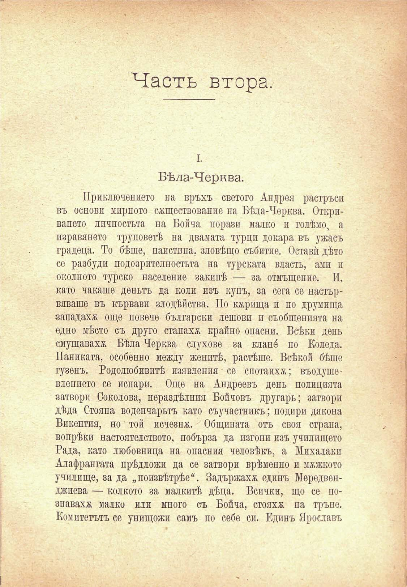

Часть втора.

I.

Бѣла-Черква.

Приключението на връхъ светото Андрей растръси въ основи мирното сѫществование на Бѣла-Черква. Откривапето личностьта на Бойча порази малко и голѣмо, а изравянето труповетѣ па двамата турци докара въ ужасъ градеца. То бѣше, наистина, зловѣщо събитие. Оставѝ дѣто се разбуди подозрителностьта на турската власть, ами и околното турско население закипѣ — за отмъщение. И, като чакаше деньтъ да коли изъ купъ, за сега се настървяваше въ кървави злодѣйства. По кърища и по друмища западаха още повече български лешови и съобщенията на едно мѣсто съ друго станаха крайно опасни. Всѣки день смущаваха Бѣла Черква слухове за клано́ по Коледа. Паниката, особенно между женитѣ, растѣше. Всѣкой бѣше гузенъ. Родолюбивитѣ изявления се спотаиха; въодушевлението се испари. Още на Андреевъ день полицията затвори Соколова, нераздѣлния Бойчовъ другарь; затвори дѣда Стояна воденчарьтъ като съучастникъ; подири дякона Викентия, но той исчезпж. Общината отъ своя страна, вопрѣки настоятелството, побърза да пзгони изъ училището Рада, като любовница на опасния человѣкъ, а Михалаки Алафрангата прѣдложи да се затвори врѣменно и мжжкото училище, за да „поизвѣтрѣе“. Задържаха единъ Мередвепджиева — колкото за малкитѣ дѣца. Всички, що се познавахж малко или много съ Бойча, стояха па тръне. Комитетътъ се унищожи самъ по себе си. Единъ Ярославъ

